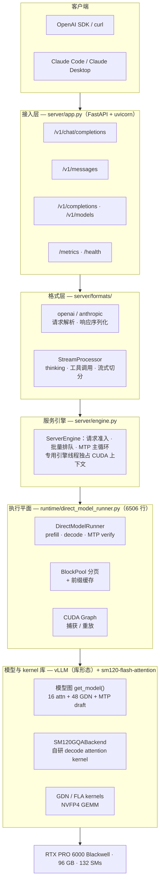
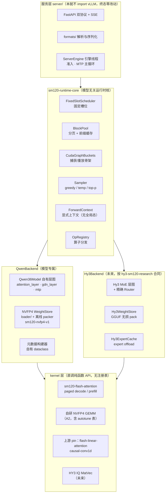
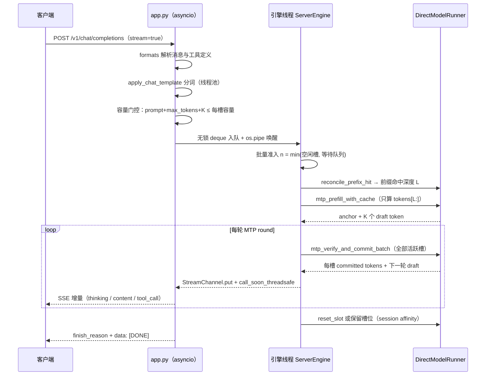
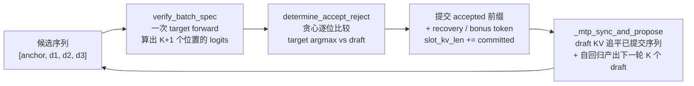
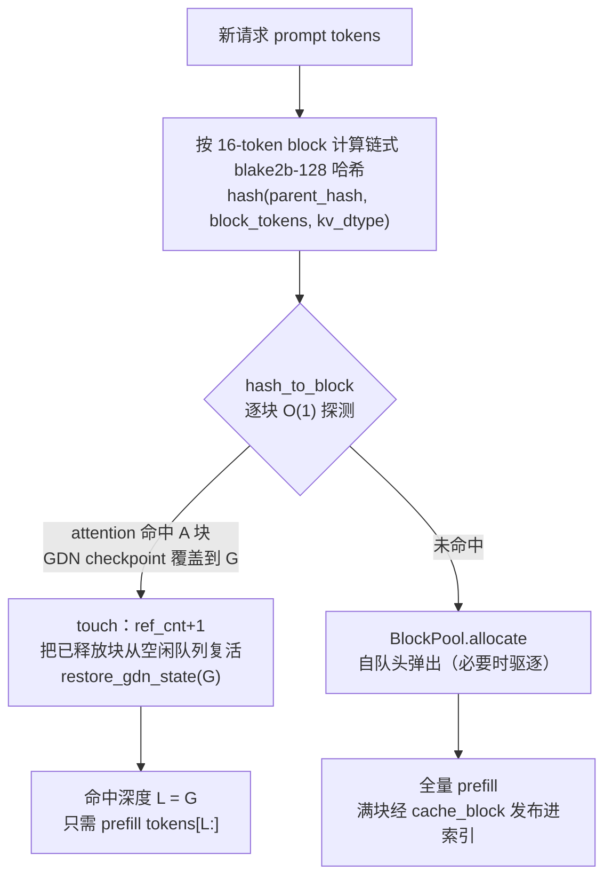

# BlackForge 系统架构与技术设计

> **Blackwell inference, forged for speed.**
> 一台软件意义上的「Qwen3.6-27B 专用推理机」：为 NVIDIA Blackwell（SM120）单卡场景从零构建的全栈推理引擎，自研 CUDA attention kernel、FP8 KV cache、MTP 投机解码、CUDA Graph 与内容寻址前缀缓存，对外提供 OpenAI 与 Anthropic 双协议 API。
>
> 关键指标：decode attention **1.56×** vs FlashInfer · 单卡 96 GB 支持 **256K 上下文** · **222 tok/s**（128K × 4 并发）· MMLU-Pro **84.5%**（官方 86.2，噪声内）
>
> 本文档编制于 2026-07-22，基于 README、《项目实施规划》、notes/ 设计文档及对 `server/`、`runtime/` 源码的逐文件调研。性能与质量数据均可由 `benchmarks/` 内脚本复现。文档同时描述**现状架构**（第 2 节）与**完全剥离 vLLM 后的终态架构**（第 3 节）——后者是路线图 B7 主线所有替换工作的收敛方向。

## 目录

1. [项目定位：一台专用推理机](#1-项目定位一台专用推理机)
2. [现状架构：两平面、五层](#2-现状架构两平面五层)
3. [终态架构：完全剥离 vLLM 之后](#3-终态架构完全剥离-vllm-之后)
4. [请求生命周期与线程模型](#4-请求生命周期与线程模型)
5. [固定槽位调度与混合缓存](#5-固定槽位调度与混合缓存)
6. [MTP 投机解码](#6-mtp-投机解码)
7. [CUDA Graph 捕获与重放](#7-cuda-graph-捕获与重放)
8. [内容寻址前缀缓存](#8-内容寻址前缀缓存)
9. [API 兼容层与流式协议](#9-api-兼容层与流式协议)
10. [权重加载与模型配置](#10-权重加载与模型配置)
11. [可观测性](#11-可观测性)
12. [质量与性能验证](#12-质量与性能验证)
13. [工程化、边界与路线图](#13-工程化边界与路线图)

---

## 1. 项目定位：一台专用推理机

主流推理框架（vLLM、TGI）使用面向多代 GPU 的通用 attention kernel（FlashInfer / FlashAttention），在 SM120（Blackwell 消费级/工作站）上留下了可观的性能空间——它们没有利用 16 字节 `cp.async` 向量化加载、特定的 shared memory bank 布局等 SM120 独有特性。BlackForge 的立项判断是：**与其无限扩展一个 vLLM attention backend，不如构建一台只服务单一工作负载的专用推理机**，其性能上限显著更高。

为此，第一版的支持范围被刻意冻结：

| 维度 | 固定范围 |
|---|---|
| GPU | 单张 RTX PRO 6000 Blackwell（SM120，CC 12.0，96 GB，132 SMs） |
| 模型 | `Qwen3.6-27B`（NVFP4 量化权重） |
| 模型结构 | 64 层混合架构 = 16 层 full attention + 48 层 GDN（Gated DeltaNet 线性注意力）；GQA 24:4，head_dim 256 |
| 并发 | 1 – 4 个请求（面向多 coding agent 场景） |
| KV cache | FP8 e4m3（显存减半 → 单卡 256K 上下文） |
| 投机解码 | 模型自带 MTP（Multi-Token Prediction）层，K=3 |
| 接口 | OpenAI + Anthropic 兼容 API，SSE 流式 |
| 暂不支持 | 多卡、LoRA、beam search、采样（目前 greedy）、其他模型 |

> **命名说明**：产品与 GitHub 仓库名为 **BlackForge**；包目录沿用历史名 `qwen-sm120-runtime`；环境变量前缀为 `QSR_`（Qwen SM120 Runtime）。三者指同一系统。自研 CUDA kernel 独立于 `sm120-flash-attention` 仓库维护，作为「kernel 实验室」，只有通过正确性与性能门禁的 kernel 才进入本运行时。

## 2. 现状架构：两平面、五层



### 2.1 控制平面与执行平面

代码库存在清晰的两层结构。**控制平面**是四个刻意做小的纯 Python 契约模块（合计约 235 行，不持有任何 CUDA tensor）：`slot_manager.py`（固定槽位所有权，`FixedSlotManager`）、`hybrid_cache.py`（缓存几何与生命周期契约，强制校验 16+48 层结构）、`op_registry.py`（可替换算子分发表）、`engine.py`（eager 执行状态机 `PREFILL → DECODE → COMPLETED`）。

**执行平面**是 `runtime/direct_model_runner.py`——单文件 6506 行的 `DirectModelRunner`，持有全部 GPU 状态：KV/GDN cache 张量、分页池、CUDA Graph、MTP 循环，直接驱动 `model.forward()`。它复用 vLLM 的四个原语——`EngineArgs.create_engine_config()`、`get_model()`、`bind_kv_cache()`、`set_forward_context()`——但绕开 vLLM 的 Scheduler 与元数据构建器，自行手工构建 attention / GDN 元数据。

### 2.2 所有权转移阶梯

从「完整 vLLM」走到「全自研编排」不是一步到位，而是保留了一条可对照的阶梯，每一级只替换一个变量，用于隔离正确性问题（曾借此定位过一个 100% 确定性错误输出的根因）：

| 阶段 | 模块 | 内容 |
|---|---|---|
| Stage A | `vllm_inprocess_baseline` | 进程内跑真实 vLLM `LLM` 类，作为无 HTTP 的正确性 oracle，证明 kernel 本身无误 |
| Stage B | `vllm_stage_b_baseline` | 只把 KV/GDN 张量分配换成自研 `allocate_fixed_slot_kv_caches`，其余全用 vLLM |
| Stage C | `vllm_stage_c_baseline` | 进一步换入自研 `build_attention_metadata` / `build_gdn_metadata` |
| 当前生产路径 | `DirectModelRunner` | 全自研编排：固定槽位、分页、前缀缓存、MTP 循环、CUDA Graph，vLLM 仅作模型/kernel 库 |

### 2.3 OpRegistry：渐进替换策略

核心设计原则是建立统一的算子注册表：`ops.attention(...)`、`ops.gdn(...)`、`ops.nvfp4_linear(...)` 等每个算子最初调用 vLLM / FlashInfer / torch 实现，之后**一次替换一个**为自研 kernel，模型图保持不变。这避免了「所有东西写完之后才第一次运行模型」的危险模式——目前 decode attention 已被自研 SM120 kernel 替换（见第 12 节的 1.56× 对比），GDN 与 NVFP4 GEMM 仍在路线图上。

### 2.4 现状的结构性短板

现状架构的最底层（模型与 kernel 库层）经由本地 vLLM 树提供，构成**运行时硬依赖**：模型图与 NVFP4 加载、attention backend 注册、KV 绑定、FLA 算子、MTP draft 加载全部穿过它。这带来三个问题：① 无法独立部署维护（依赖不可复现的本地状态）；② 使用的是 vLLM **内部 API**，版本升级即破坏；③ 多模型平台化（Hy3Backend）被一个与目标无关的重依赖挡路。终态解法见第 3 节。

## 3. 终态架构：完全剥离 vLLM 之后

> 本节是路线图 B7「去 vLLM 化」主线（V0–V3）的**收敛蓝图**：每一次替换都必须落在这张图的某个格子里，否则就是跑偏。终态验收门禁：**干净 venv（未安装 vLLM）中 `python -m server.app` 起服务，质量回归全绿**。替换的节奏由证据拉动（性能证据或平台证据），但方向由本节固定。

### 3.1 终态分层图



与现状图（第 2 节）对比，变化只发生在最下面两层：「vLLM（库形态）」整层消失，拆解为**模型无关的 core、模型专属的 backend、直调的 kernel 层**三部分；服务层与调度/缓存/MTP 的全部逻辑原地保留。

### 3.2 逐项替换映射（vLLM 原语 → 终态组件）

这张表是 B7-V2 的作战地图——每个 vLLM 触点对应一个终态组件、一个关键设计决策和一个拉动信号：

| 现状（vLLM 提供） | 终态组件 | 关键设计 | 拉动信号 |
|---|---|---|---|
| `get_model()` / `EngineArgs` / `VllmConfig`（模型图构建 + 配置） | `Qwen36Model` 自有层图（`model/qwen36_model.py` + `attention_layer.py` + `gdn_layer.py` + `mtp.py`，按原《项目实施规划》补齐）+ 自有 `RuntimeConfig`（`QSR_*` 直读，不再绕道 vLLM config 体系） | 层图按 `qwen36_config.py` 已验证的 16+48 合同构建；每层只做「取权重 → 调 kernel → 写状态」，无框架抽象税 | E1 抽象层 / A1 GDN block 级融合 |
| NVFP4 量化 linear op | 自研 SM120 NVFP4 GEMM（A2）+ per-shape autotune 表（prefill M / decode M=1..4 / verify M=4..16）；过渡期 vendor vLLM 该 op 源码（Apache-2.0，注明出处） | 权重经离线 packer 转成 kernel-native 布局（见 3.4），运行时零转置 | A2 性能证据（占比排序） |
| `set_forward_context()`（全局/隐式 forward 上下文） | `ForwardContext` 显式传参（见 3.3） | 消灭 thread-local 与全局态；图捕获安全由构造保证而非约定 | V1 即可做（薄依赖） |
| `bind_kv_cache()`（KV 张量绑定进模型层） | 构造期注入：runner 分配 KV/GDN 张量，各层在构造时拿到自己的持久 view | 地址终身固定与 CUDA Graph / 固定槽位契约天然一致，绑定从「运行时机制」降级为「构造参数」 | V1 即可做（薄依赖） |
| `SM120GQABackend` + `register_backend`（attention backend 注册体系） | 直调纯函数 API：`sm120-flash-attention` 暴露 `paged_decode_attention(q, kv, page_table, meta)` 等入口，`attention_layer.py` 直接调用 | kernel 本来就是自研的，注册胶水只为让 vLLM 机器调它——自有层图下这层间接失去存在理由，直接删除 | V1 即可做（薄依赖） |
| `SM120GQAMetadata` / `GDNAttentionMetadata`（元数据类型） | 自有 dataclass（字段与现有手工构建逻辑一一对应，`build_attention_metadata*` / `build_gdn_metadata*` 原样保留） | 现状本就绕开 vLLM 的 MetadataBuilder 手工构建，只是借了类型定义——搬进本仓库即断开 | V1 即可做（薄依赖） |
| FLA 算子 / causal-conv1d（经 vLLM 转手） | 直接 pin 上游 pip 包 `flash-linear-attention` / `causal-conv1d` | 版本进 lock 文件；切换时单独过 1000-step GDN 状态演化 parity | V1 即可做（中层依赖） |
| `load_eagle_model()`（MTP draft 加载） | 自有 MTP 模块（仅 attention 的小型解码器，与 target 共享 embedding / lm_head，共用 block-id 命名空间） | draft 层图极小，随 `Qwen36Model` 一并落地 | A3 MTP 融合 / E1 |
| `init_worker_distributed_environment`（CUDA 上下文初始化） | 引擎线程内直接 `torch.cuda` 初始化（单卡无分布式，本就不需要 worker 抽象） | V1 即可做（薄依赖） | — |

### 3.3 ForwardContext：从隐式全局态到显式数据流

这是终态架构最重要的单项设计变更。现状里，一次 forward 的元数据经 `set_forward_context()` 挂到 vLLM 的全局 forward context，模型层在深处隐式读取——这带来图捕获时序的隐式约定、测试必须整机起 vLLM 环境、以及多 backend 共存时的全局态冲突。终态改为：

```python
@dataclass
class ForwardContext:
    attn_metadata: SM120AttnMetadata      # CSR 页表、kv_lens、split-KV 参数（持久 buffer 引用）
    gdn_metadata: GDNMetadata             # conv/SSM 状态行索引、spec 行选择、chunk 索引
    slot_mapping: torch.Tensor            # token → 物理 KV 槽位
    kv_caches: list[torch.Tensor]         # 每 attention 层的持久 KV view（构造期注入亦可）
    spec_state_rows: torch.Tensor | None  # MTP verify 的 1+K 行 SSM 选择
```

每次 forward 显式传入：`model(input_ids, positions, ctx)`。三个直接收益：

1. **图捕获安全由构造保证**：`ForwardContext` 的每个字段都指向构造期分配的持久 buffer，capture/replay 只做 `.copy_()` 填充——「graph-safe」从人为纪律变成类型结构；
2. **可测试性**：层图组装、元数据流转可在 CPU-only 单测中验证（延续本仓库 170+ CPU 测试的传统），不再需要「起一个 vLLM 环境」才能碰模型代码；
3. **多 backend 共存**：QwenBackend 与 Hy3Backend 各自持有各自的 context 类型，没有全局态可以互相污染——这是双租户 core 的前提。

### 3.4 权重加载流水线（终态）

`loader/` 从「元数据校验层」升级为完整加载器，兑现《项目实施规划》Phase 2 当年的设计：

```
HF checkpoint（safetensors 分片 + index）
  │  checkpoint_index.py：交叉校验 index/分片头、NVFP4 伴生校验（weight_packed ↔ weight_scale）、
  │  qwen36 层型校验（16 attn + 48 GDN + MTP 张量齐全）—— 任何 23 GB 分片被 mmap 之前完成
  ▼
离线 packer（一次性，慢可接受）
  │  产物布局 sm120-nvfp4-v1（pack_manifest.py 版本化 + 源指纹 + checksum）：
  │  NVFP4 MMA 所需 swizzle · fused QKV · fused gate-up · 对齐与 padding · per-layer metadata
  ▼
运行时加载（每次启动，快）
  │  TensorReader 按 manifest mmap 直读 kernel-native 布局，零运行时转置
  ▼
WeightStore → Qwen36Model 构造期注入
```

设计要点：**运行时禁止大规模权重变换**（转置/swizzle/融合全部离线完成）；manifest 是唯一 runtime-facing 索引；packer 版本与 kernel 版本互相校验，布局不匹配在启动期报错而非产出错误数值。这一结构与 HY3 的「GGUF → 无损 pack → Hy3WeightStore」流水线**同构**——两个 backend 的加载路径共享「校验 → 离线 pack → manifest → mmap」四段式骨架，只是量化格式插件不同。

### 3.5 依赖面终态

| 类别 | 依赖 | 说明 |
|---|---|---|
| 运行时必需 | `torch`（pinned）· `triton` · `flash-linear-attention` · `causal-conv1d` · `safetensors` · `fastapi` / `uvicorn` | 全部为窄接口、语义稳定的公开发行版，进 lock 文件 |
| 自有二进制 | `sm120-flash-attention` 扩展 · 自研 NVFP4 GEMM | 独立仓库构建，纯函数 API |
| dev extras（可选） | `vllm==<pinned>` · `pytest` · `ruff` | vLLM 仅用于 A/B 基线对比（`extras/` 下的 `vllm_*_baseline.py`），生产路径零引用 |

对比现状：vLLM 从「运行时硬依赖 + 内部 API + 本地不可复现状态」降级为「可选 dev 依赖 + 仅公开入口 + pinned 发行版」。

### 3.6 迁移不变量（什么绝对不变）

终态迁移是**换底不换脸**——以下契约在 V0–V3 全程冻结，golden fixtures bit-parity 是每一步的裁判：

- **对外行为**：HTTP API、SSE 事件序列、`QSR_*` 配置面、Prometheus 指标名，用户可见零变化；
- **调度与缓存语义**：固定槽位、INV7（物理 block 0 保留）、BlockPool 引用计数与驱逐、前缀缓存全部不变量（INV*/R*）；
- **MTP 无损性**：接受判定与 target greedy 精确等价，开启/关闭 MTP 输出逐 token 一致；
- **数值**：greedy 固定 prompt 集逐层 logits / GDN state / MTP 接受序列与替换前 bit 级一致（容差仅在算子实现本身改变时按 oracle 标准单独申报）；
- **方法论**：Stage A/B/C 一次一个变量、oracle 逐层比对、每步可独立回退。

### 3.7 与双租户平台的收敛

终态图中的 `sm120-runtime-core` 即路线图 E1 抽象层与 `hy3-sm120-research` 所规划「共同 core」的同一实体：core 只认三个接口——**模型描述**（层型序列 + 缓存物种几何）、**量化插件**（loader 校验 + GEMM 派发）、**格式适配**（chat template / thinking / 工具语法）。QwenBackend 是第一个实现（NVFP4 + paged FP8 KV + GDN 槽驻留态），Hy3Backend 是第二个（GGUF IQ 系 + 量化 paged KV + expert cache 新缓存物种）。去 vLLM 化在此获得平台红利：HY3 链本就不经 vLLM，core 无 vLLM 化后，两租户共架时不存在「一个 backend 拖着一个别人用不到的重依赖」的结构缺陷。

## 4. 请求生命周期与线程模型

asyncio 事件循环永不触碰 GPU；一条专用引擎线程独占 CUDA 上下文跑完全部推理。



### 4.1 线程间通信

`ServerEngine` 启动名为 `blackforge-engine` 的 daemon 线程，在其中完成模型加载与所有 GPU 操作（`_engine_thread_main → _step_sync` 循环）。两条通道连接两个世界：

- **请求通道（asyncio → 引擎）**：无锁 `collections.deque` 加一对 `os.pipe()`。引擎空闲时阻塞在 `os.read(pipe)` 上，零 CPU 占用；新请求写一个字节即唤醒。
- **结果通道（引擎 → asyncio）**：每请求一个 `StreamChannel`（deque + `asyncio.Event`），引擎线程 `put()` 后通过 `loop.call_soon_threadsafe` 唤醒 SSE 生成器；非流式请求则经 Future 一次性解析。

每轮 MTP round 末尾 `time.sleep(0)` 主动让出 GIL，保证事件循环有机会把已产出的 token 推给客户端。容量门控（`capacity_ok`）被前置到 asyncio 层：超出 `prompt + max_tokens + K` 上限的请求直接返回 400，在到达 runtime 之前就拦截了已知的 whole-batch attention 崩溃形态。

## 5. 固定槽位调度与混合缓存

放弃通用连续批处理，换取地址终身固定的极简热路径——这是 CUDA Graph 与 GDN 状态正确性的地基。

### 5.1 固定槽位（Fixed Slots）

系统预分配 `num_slots` 个物理槽位，每槽的 KV/GDN 状态地址终身固定；请求动态进出槽位，但状态从不搬移，只更新逻辑映射。并发上限 `capacity ≤ 4`。一个关键不变量（INV7）：**物理 block 0 永久保留**，所有逻辑槽经 `_physical_slot(slot) = slot + 1` 映射——因为真实 vLLM 调度器从不产出物理索引 0，早期「逻辑槽 = 物理索引」的硬编码曾导致 100% 确定性错误输出。

容量三元组 `capacity / num_slots / blocks_per_slot` 的换算（block_size = 16 token）：

| blocks_per_slot | 每槽上下文 | 并发 | GPU 显存 | 典型场景 |
|---:|---:|---:|---:|---|
| 16384 | 256K | 2 | ≈ 93 GB | 超长上下文（当前生产配置） |
| 8192 | 128K | 4 | ≈ 70 GB | 多 agent 并发 |
| 4200 | 67K | 4 | 更低 | 常规对话 |

### 5.2 混合缓存：Paged KV + GDN 状态

Qwen3.6 的 64 层混合架构决定了缓存必须是「双物种」的：

- **16 层 full attention → 分页 KV cache**：FP8 e4m3，按 16-token block 动态分配，`BlockPool` 引用计数管理，前缀缓存命中块可跨请求共享。FP8 的量化/反量化由 SM120 attention backend 的 kernel 处理，runtime 只按 backend 声明的 dtype/shape 分配张量。
- **48 层 GDN → 按槽位驻留的 conv + SSM 状态**：不分页（递归状态没有可截断的位置索引）；每个物理槽预留 **1 + K 行** SSM 状态（K=3），其中 column 0 为主行、column 1..K 为投机候选专用行（见第 6 节）。

## 6. MTP 投机解码

利用 Qwen3.6 自带的 Multi-Token Prediction 层做 draft 模型，K=3，输出与 greedy 逐 token 无损等价。



### 6.1 draft / verify 分工

**target 模型**是完整的 27B 混合架构（16 attn + 48 GDN）；**draft 模型**是权重内置的 MTP 层（仅 attention，无 GDN），二者共享 embedding 与 lm_head，且共用同一个 block-id 命名空间（17 个注意力层的 KV：16 target + 1 draft）。prefill 时 target 先算出首 token（anchor）与 hidden states，随后 `_mtp_sync_and_propose` 用 target 的 hidden 对 draft 做 teacher-force 同步，再自回归 K−1 步产出 K 个 draft token。

verify 阶段把 `[anchor] + drafts` 共 K+1 个位置塞进一次 target forward，贪心逐位比较 target argmax 与 draft：匹配则接受，首个不匹配位置给出 recovery token，全部匹配则奖励 bonus token。实测接受率约 50%，即每轮平均产出约 2 个 token。

### 6.2 GDN 状态的投机难题与解法

GDN 是递归状态，**没有「回退到位置 p」的天然能力**——一旦按被拒绝的 draft 更新了状态就无法截断。早期实现依赖 snapshot / restore / 重算 forward 修复，成本高且易错。当前机制改用真实 spec-decode GDN kernel：每槽预留 `1 + K` 行 SSM 状态，一次 verify forward **无条件**算出所有候选位置的因果有效输出，只有「哪一行留到下一轮读」这个 state commit 决策是 acceptance-aware 的（由 `num_accepted_tokens` 选行）。被拒绝候选写入的行下一轮永不被读——无需任何快照、恢复或重算。

> **正确性含义**：接受判定是与 target greedy 的精确比较，因此 MTP 只改变吞吐，不改变输出分布——开启/关闭 MTP 的 greedy 输出逐 token 一致（回归套件持续验证）。

## 7. CUDA Graph 捕获与重放

把 decode 热路径的 kernel launch 开销压到零——固定槽位设计在此兑现。两个捕获类覆盖两个模型：

- `CapturedBatchDecodeGraph` —— target 模型的 batch decode / MTP verify（固定 batch_size + 固定 qo_len：纯 decode 为 1，verify 为 K+1）；
- `CapturedMTPDraftStepGraph` —— draft 模型的连续 decode 步，另带 `replay_incremental` 快路径：KV 只增 1 且未跨页时跳过页表重建。

关键工程决策：

- **构造期预捕获**：初始化末尾一次性为所有支持的 batch size 捕获全部图，把捕获成本移出请求路径；
- **专用 warmup 槽**：捕获前需 3 次真实 warmup forward，而 GDN 递归状态*非幂等*——绝不能用真实请求槽 warmup，故永久保留末尾 batch_size 个槽专供捕获（要求 `num_slots ≥ 2 × batch_size`）；
- **固定地址重放**：replay 只把真实 `(slot_ids, token_ids, kv_lengths)` 经 `.copy_()` 写入持久 buffer（CSR 元数据、input_ids、positions、slot_mapping、spec 状态行索引），随后 `graph.replay()`；split-KV 参数在构造期按 `blocks_per_slot × block_size` 上界一次性推导，任意真实 kv_len 均可安全重放；
- **eager 兜底**：`enable_cudagraph=False` 时静默回退 eager 路径——所有正确性测试默认在 eager 下跑，图路径与 eager 的一致性由专门的 parity 基准守护。

## 8. 内容寻址前缀缓存

多轮对话与多 agent 共享 system prompt 的场景下，用内容哈希跨请求复用 KV——难点在 GDN 状态也要能一起复原。



### 8.1 BlockPool：引用计数 + LRU 驱逐

- **链式哈希**：block i 的哈希依赖整个前缀（parent_hash 链），并把 `kv_cache_dtype` 混入 extra key，保证 FP8 与 NVFP4 KV 永不在同一前缀上碰撞；
- **引用计数生命周期**：`allocate`（自空闲队头弹出，ref_cnt=1）→ `reference / touch`（同轮 fan-out 共享、命中复活）→ `free`（归零时：带哈希的块挂队尾保持可命中，无哈希的挂队头优先淘汰）；
- **空闲队列**：侵入式双向链表，append / popleft / remove 全部 O(1)；块释放后哈希仍保留在索引里，因此缓存前缀可跨 `reset_slot` 复活——这是「持久」前缀缓存的关键；
- **驱逐联动**：仅在真实池压力下触发；驱逐 attention 块时同步删除同哈希键的 GDN checkpoint，保证两个缓存物种永不失配（不变量 INV3/R5）。

功能按三级开关渐进启用：`enable_block_table`（分页）→ `enable_prefix_cache`（同轮 fan-out 共享）→ `enable_persistent_prefix_cache`（跨请求内容寻址），层层依赖、可独立回退。另有 session affinity 选项：会话结束后保留槽位一段 TTL，下轮同会话直接续用。

## 9. API 兼容层与流式协议

同一引擎，双协议输出：OpenAI chunk 流与 Anthropic 事件流，thinking 与工具调用在 token 流上实时切分。

| 端点 | 协议 | 能力 |
|---|---|---|
| `POST /v1/chat/completions` | OpenAI | 流式 + 非流式，工具调用，reasoning_content |
| `POST /v1/messages` | Anthropic | 流式 + 非流式，thinking / tool_use block（Claude Code 与 Claude Desktop 可直连） |
| `POST /v1/messages/count_tokens` | Anthropic | 发送前 token 计数 |
| `POST /v1/completions` | OpenAI | 文本补全（非流式） |
| `GET /v1/models` | OpenAI | 模型卡（含 max_model_len） |
| `GET /metrics` · `/health` · `/debug/stats` | — | Prometheus / 存活探测 / 引擎内部计数 |

### 9.1 formats/：解析与序列化全部收口

`app.py` 只做路由与引擎交互，所有格式逻辑收口在 `server/formats/`：`openai.py` / `anthropic.py` 负责消息解析与响应构建（Anthropic 侧还会剥离 Claude Code 注入的计费 block，避免污染前缀缓存命中）；`tools.py` 把两家的工具定义转成 Qwen3.6 chat template 格式，并把模型输出的 tool_call XML 解析回结构化 tool_calls；`thinking.py` 处理 chat template 注入的思考标记（含 6 种残缺形态的剥离）。

### 9.2 StreamProcessor：token 流上的状态机

流式输出的难点是切分边界：思考内容要走 `reasoning_content`（OpenAI）或 `thinking_delta`（Anthropic），可见正文要在工具调用 XML 的起始处冻结，未完成的标签前缀不能泄漏给客户端。`StreamProcessor` 作为有状态处理器逐轮吃进 token，暴露 `drain_thinking / drain_content / finalize` 三个安全出口。Anthropic 侧还有一个兼容细节：进入正文前必须显式关闭 thinking block（补发 `signature_delta`），否则 Claude Desktop 会丢弃后续 tool_use。

## 10. 权重加载与模型配置

校验先行：任何 23 GB 分片被 mmap 之前，checkpoint 的完整性已经被证明。

`loader/` 是纯元数据层（约 340 行）：`safetensors_header.py` 只读 8 字节长度 + JSON 头，不物化权重；`checkpoint_index.py` 交叉校验 index 与各分片头的一致性，并做两类结构校验——**NVFP4 伴生校验**（每个 `.weight_packed` 必须有配套 `.weight_scale` block-scale 张量）与 **Qwen3.6 层型校验**（GDN 层 vs attention 层各自所需张量齐全）。`pack_manifest.py` 为离线 SM120 打包布局（`sm120-nvfp4-v1`）生成带源指纹的版本化清单。**现状**下实际 GPU 加载与 NVFP4 反量化经 vLLM 的 `get_model()` 完成；**终态**下由本仓库的离线 packer + `TensorReader` + `WeightStore` 流水线接管（见 3.4 节）。`model/qwen36_config.py` 在加载之前强制校验 16 + 48 的层结构与 MTP 配置。

运行配置全部经 `QSR_*` 环境变量注入（CLI flag 会写回环境变量再启动 uvicorn）：

| 变量 | 默认 | 作用 |
|---|---|---|
| `QSR_SERVER_CAPACITY` | 4 | 最大并发请求数 |
| `QSR_SERVER_NUM_SLOTS` | 8 | 物理槽总数（含 CUDA Graph warmup 槽） |
| `QSR_SERVER_BLOCKS_PER_SLOT` | 16384 | 每槽 KV block 数（×16 = token 容量，16384 ⇒ 256K） |
| `QSR_SERVER_KV_CACHE_DTYPE` | fp8_e4m3 | KV cache 精度 |
| `QSR_SERVER_ENABLE_CUDAGRAPH` | 1 | CUDA Graph 捕获开关 |
| `QSR_SERVER_ENABLE_PREFIX_CACHE` | 1 | 前缀缓存开关 |
| `QSR_SERVER_PRODUCTION` | 1 | 生产模式：跳过诊断校验槽 |
| `SM120_VLLM_INTEGRATION` | (auto) | sm120-flash-attention 集成路径（终态下由直调 API 取代） |

## 11. 可观测性

Prometheus 指标沿用 vLLM 命名约定（`vllm:*`），现有看板可直接复用；实现为零依赖的手写 histogram/counter。

| 维度 | 指标（节选） |
|---|---|
| **速度** | `e2e_request_latency_seconds` · `time_to_first_token_seconds` · `request_time_per_output_token_seconds` · prompt/generation token 直方图与吞吐计数器 |
| **稳定性** | `num_requests_running / waiting` · `request_success_total`（按 finish_reason）· `request_errors_total`（按状态码）· `kv_cache_usage_perc` · 空闲槽位数 |
| **正确性** | `bootstrap_checks_ok / failed_total`（投机 prefill 首 token 独立比对）· `prefix_cache_hit_rate / hits / misses` |

其中 bootstrap check 值得一提：非生产模式下，每次准入都会在独立参考槽上重跑一次 reference prefill，比对首 token 是否一致——把「投机路径悄悄算错」这类最难察觉的故障变成一条可告警的曲线。

## 12. 质量与性能验证

性能收益必须以「无损」为前提：与官方分数对标 + 与 stock vLLM 做 A/B + 自建回归门禁，三层证据链。

### 12.1 Kernel 性能：自研 vs FlashInfer

Decode attention 单步延迟（128K context · batch=4 · GQA 24→4 · head_dim=256 · FP8 KV · paged）：

| 实现 | 延迟 | 相对 |
|---|---:|---:|
| **BlackForge（自研 SM120 kernel）** | **0.988 ms** | **1.56×** |
| FlashInfer（通用 kernel） | 1.540 ms | 1.00× |

1.56× 加速来自 SM120 专有优化：16 字节 cp.async 向量化加载 · 272 字节对齐 shared memory stride · 每请求 32 路 split-K（匹配 132 SMs）。仅在同条件下对比 kernel 级延迟，不做端到端跨框架吞吐对比。

端到端吞吐（warm 前缀缓存，已确认 token）：**222 tok/s**（128K × 4 并发）、**267 tok/s**（64K × 4 并发）。

### 12.2 与官方分数对标：MMLU-Pro

414 题分层抽样（每类约 30 题），thinking 模式、5-shot CoT、greedy、max_tokens=32768、零截断。**84.54% vs 官方模型卡 86.2**，−1.7pp 落在 414 题子集 ±3.5% 的抽样噪声之内——本地推理质量相对原始模型无退化。

| 类目 | 准确率 | 类目 | 准确率 |
|---|---:|---|---:|
| 物理 | 97.8% | 历史 | 84.6% |
| 数学 | 95.7% | 法律 | 81.6% |
| 化学 | 92.3% | 商业 | 81.5% |
| 生物 | 92.0% | 心理 | 77.8% |
| 工程 | 87.9% | 健康 | 75.0% |
| 经济 | 86.2% | 哲学 | 64.7% |
| 计算机 | 85.7% | 其他 | 59.4% |

STEM 强、人文偏弱是模型本身画像（同权重 stock vLLM 得分相同），非运行时缺陷。

### 12.3 A/B 对照与回归门禁

| 验证 | 方法 | 结果 |
|---|---|---|
| HumanEval+ A/B | 同权重、同 harness、同 prompt，仅后端不同（stock vLLM vs BlackForge），164 题 greedy | 0.445 / 0.433 vs vLLM 0.433 / 0.427（+1.2pp / +0.6pp，噪声内，无系统性退化） |
| 工具调用回归 | 20 组工具 schema + 查询，精确匹配 | **100%** |
| Agent 循环回归 | 多轮 plan → call → observe → answer | **100%** |
| 长上下文回归 | Needle-in-haystack @ 8K / 32K / 64K / 128K | **100%** |
| 逐层 Oracle | `oracle/`：给 vLLM 挂只读 hook，采集每层输入/输出、GDN state、logits，与自研实现逐层比对 | 新实现的正确性护栏（开发期） |

支撑这一切的是 80 余个可复现基准脚本（`benchmarks/`）：从 nsys/ncu 级的 kernel 剖析、CUDA Graph 与 eager 的 parity 检查、MTP 接受率追踪，到 256K 长上下文的容量压测，均可单命令重跑。

## 13. 工程化、边界与路线图

### 13.1 工程护栏

- **170+ CPU-only 单元测试**：调度、缓存、格式层、前缀缓存不变量均可在无 GPU 环境验证，依赖 torch 的用例自跳过；
- **CI 门禁**：ruff lint + format 检查 + 单测，每次 push / PR 必跑，pre-commit 钩子本地同款；
- **设计决策留痕**：`notes/` 下的设计文档（direct-model-runner 238KB、prefix-cache 51KB 等）记录了每个不变量（INV*/R*）的来龙去脉，代码注释与之交叉引用；
- **生产回退**：部署侧保留 stock vLLM 服务作为 fallback——专用引擎异常时可切回通用路径。

### 13.2 当前边界

- 仅 greedy 解码（采样参数接受但不生效，保证客户端兼容）；
- 单模型（Qwen3.6-27B-NVFP4）、单 GPU、仅 SM120；
- KV 容量按槽静态划分（上下文长度与并发的组合需在启动时确定）。

### 13.3 路线图

后续规划（性能深挖、去 vLLM 化 B7 主线、架构弹性化、兼容层补全、观测性加固、多模型支持）详见 [roadmap.md](roadmap.md)。其中第 3 节的终态架构即 B7 的收敛蓝图：V1 阶段完成全部「薄依赖」替换与依赖收口，V2 按证据拉动逐个落地 3.2 节映射表中的厚组件，V3 关闭零依赖门禁。
