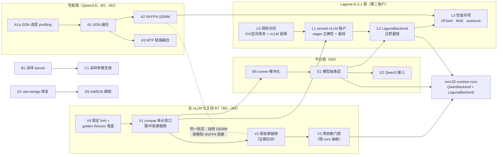

# BlackForge 后续路线图（2026 H2 → 2027 H1）

> 从「Qwen3.6-27B 专用推理机」演进为「SM120 上的小型多模型推理平台」。五条并行轨道：当前模型性能深挖、架构弹性化（含去 vLLM 化主线）、兼容层补全、观测性与质量加固、多模型支持（Qwen3 系列 与 **poolside Laguna-S-2.1**）。第二租户目标模型于 2026-07-22 由 HY3 改为 **Laguna-S-2.1-NVFP4**（对比论证见第 8 节）；`hy3-sm120-research` 调研归档为方法论资产。每一项都沿用既有的门禁文化：有证据才动手，过回归才合入。
>
> **里程碑**：
> - **M1（2026-08）补齐与加固**：采样真实生效 · slot-wedge 修复 · 长稳 soak · GDN profiling 取证 · Laguna L0 调研合同（KV/显存账本 + pinned vLLM 冒烟）· 去 vLLM 化 V0–V1（独立建仓：pin 官方 vLLM + compat 收口）
> - **M2（2026-09/10）性能深挖**：GDN 融合 · NVFP4 GEMM autotune（兼去 vLLM 化 V2）· MTP 链路融合 · Laguna L1 冒烟租户（eager 正确性 + 基线吞吐）
> - **M3（2026-Q4）弹性与平台化**：动态 KV 分配 · 模型抽象层 · Qwen3 系列接入 · Laguna L2 Backend 接入（过质量链）· 去 vLLM 化 V2 按证据推进
> - **M4（2027-H1）新模型与扩展**：Laguna L3 性能专项（DFlash 投机 · MoE dispatch · NVFP4 autotune 扩展）· sm120-runtime-core 收敛 + 零依赖门禁（V3）· 自动回退
>
> 编制于 2026-07-22；同日修订：并入 HY3 调研现状 + 新增 B7「去 vLLM 化」主线（分步混合 + 证据拉动替换）；三修：第二租户目标模型改为 Laguna-S-2.1-NVFP4。配套架构文档见 [architecture.md](architecture.md)。

## 目录

0. [执行看板：先做什么（2026-07-22 复盘）](#0-执行看板先做什么2026-07-22-复盘)
1. [现状盘点：已锻成与未竟](#1-现状盘点已锻成与未竟)
2. [规划原则与北极星指标](#2-规划原则与北极星指标)
3. [路线总览与依赖关系](#3-路线总览与依赖关系)
4. [Track A · 当前模型性能优化](#4-track-a--当前模型性能优化)
5. [Track B · 架构优化（含 B7 去 vLLM 化）](#5-track-b--架构优化含-b7-去-vllm-化)
6. [Track C · 兼容层补全](#6-track-c--兼容层补全)
7. [Track D · 观测性与质量加固](#7-track-d--观测性与质量加固)
8. [Track E · 多模型支持（Qwen3 系列 与 Laguna-S-2.1）](#8-track-e--多模型支持qwen3-系列-与-laguna-s-21)
9. [里程碑验收与档位](#9-里程碑验收与档位)
10. [风险登记与应对](#10-风险登记与应对)
11. [不做清单](#11-不做清单)

---

## 0. 执行看板：先做什么（2026-07-22 复盘）

**已完成**：B1/C1 采样全链路 · C5 取消 + timeout · D1 watchdog · A5/B4 chunked prefill 解耦调度 · A1a profiling（4K+128K）· A2 shape survey · B7-V0 fork 存档 · B7-V1 compat 收口骨架 · 速度基线冻结 · soak 脚本 · Laguna L0 显存账本（主模型 + DFlash 权重已就位）

**关键证据（决定了下面的排序）**：A1a 实证 NVFP4 GEMM 占 **71%@4K / 54%@128K**、attention 28%@128K、**GDN 恒定仅 ~4%** —— A1 GDN 融合降级暂缓，A2 升为头号杠杆，新增 A6（attention 长上下文优化）。

**执行顺序**：

1. 🔥 **golden fixtures 落盘** —— 一切替换的裁判（尚未落盘），不做完不得开始任何替换
2. 🔥 **A2 NVFP4 GEMM autotune / 自研** —— 最大杠杆，兼去 vLLM 化 V2 第一项
3. 🔥 **B7-V1 收官** —— 薄依赖自写 + FLA 切上游 + 独立建仓门禁（干净 venv 起服务）
4. 🔥 **D4 首次 24h soak + 例行化** —— 性能大改前的护栏
5. 🔥 **L0 收尾（待办点，开发执行）** —— DFlash 校验（config / draft 机制 / K=15 形状）+ pinned vLLM 加载 Laguna 冒烟
6. ⏭ A6 attention 长上下文优化 · A3 MTP 融合 · L1 Laguna 冒烟租户
7. ⏭ B5 模块化 + E1 抽象层 · D2/D3 观测细化 · C3 结构化输出
8. ⏸ B2 动态 KV · A4 显存换速度 · C2/C4/C6 · D6 自动回退 · E2 Qwen3 · L2/L3（按原里程碑走）
9. 🧊 暂缓：**A1 GDN 融合**（占比仅 ~4%，A2/A6 榨干后再评）；远期：B6 多 GPU · V3 零依赖门禁

**一个月视界（2026-07-23 → 08-22，序号即上表）**：第 1 周并行推 ①fixtures + ③V1 收官 + ④soak 首跑 + ⑤L0 收尾；**②A2 是贯穿全月的主线**（fixtures 落盘后即开工，逐 shape 出成果、逐项过门禁）；第 2 周起 ⑥A6/A3 与 L1 冒烟接续进场；第 3–4 周 ⑦B5+E1 启动、D2/D3/C3 见缝插针。月末对账标尺 = 第 9 节 M2 出口判据（v1 档：ITL ≥10%）。

**已裁决变更**：AIME26 评测撤销（`686f421`，五层质量证据已足）· A1 降级 · 新增 A6。

## 1. 现状盘点：已锻成与未竟

| 已完成（截至 2026-07） | 未竟 / 已知短板 |
|---|---|
| 自研 SM120 decode attention kernel（1.56× vs FlashInfer）· FP8 KV + 256K 上下文 · MTP K=3 投机解码（免快照 GDN spec 机制）· CUDA Graph 全批预捕获 · 内容寻址前缀缓存（P0–P3 三级）· OpenAI/Anthropic 双协议 + SSE · Prometheus 指标 · 质量三层证据链（MMLU-Pro 对标 / HumanEval+ A/B / 回归门禁）· 170+ 单测 + CI | **仅 greedy 解码**（采样参数收下但不生效）· **16K+ 长生成存在 slot-wedge 风险**（AIME26 评测因此推迟）· **生产路径硬依赖本地 vLLM fork**（模型图 / NVFP4 加载 / FLA 算子 / backend 注册胶水——没有 `/home/bot/vllm` 服务起不来，无法独立部署维护）· KV 容量按槽静态划分（上下文/并发启动时锁死）· GDN 48 层与 NVFP4 GEMM 仍用 vLLM 通用 kernel（原规划 Phase 6/7 未启动）· 单模型硬编码假设散布在 6506 行 runner 中 · 无自动回退 · 评测覆盖缺 AIME26 / GPQA |

一句话概括：**热路径的骨架已经锻成且经过质量验证；剩下的收益藏在 GDN/GEMM 两块最大的 kernel 占比里，而平台化的前提是把「Qwen3.6 专用」的隐式假设显式化。**

> **第二份资产：`hy3-sm120-research`（2026-07-16 → 07-19）。** HY3（混元 v3）在 SM120 上的推理可行性调研已远超「spike」阶段：静态研究冻结为 v1-static（1,298 tensor 全量清点、15,168 个 expert bundle 精确清单、显存预算表）；G1 oracle、H2 确定性基线、G2 六负载真实路由 trace 已完成；G3 基线分解部分完成（语义归因被 CUPTI 限制阻塞）；T1–T5 五项静态研究收口。
> **2026-07-22 更新**：第二租户目标模型改为 Laguna-S-2.1（第 8 节），本仓库**归档为方法论资产**——静态冻结/门禁体系/expert cache 设计/路由 trace 工具在 Laguna 需要 offload 时可直接复用；若未来重启 HY3，从 v1 复验断点继续。

## 2. 规划原则与北极星指标

- **证据先行**：任何 kernel 级投入前必须有 nsys/ncu 占比数据背书（M1 的 GDN profiling 是 M2 全部性能工作的门票）；
- **质量门禁**：每次融合/替换都过完整质量回归（greedy 固定集无漂移、MTP 接受率下降 < 1pp、HumanEval+ parity），收益按 **accepted tokens/s 与 ITL** 结算，不看 draft/s；
- **一次一个变量**：沿用 Stage A/B/C 阶梯方法论，新模型接入同样先建 oracle 再替换；
- **范围解冻有序**：每个里程碑最多解冻一个「范围合同」维度（M1 解冻采样，M3 解冻单模型假设，M4 解冻投机形态与 MoE 结构），其余维持冻结。

| 北极星指标 | 当前基线 | 方向 |
|---|---:|---|
| accepted tokens/s（128K × 4 并发，warm） | 222 | 持续上升，按验收档位结算（第 9 节） |
| p50 ITL / TTFT（Agent Replay 负载） | 基线待 M1 冻结 | ITL 优先；TTFT 不明显恶化 |
| MTP 接受率 | ≈ 50% | 不因任何优化下降 > 1pp |
| 质量差值（MMLU-Pro vs 官方） | −1.7pp（噪声内） | 始终保持在抽样噪声内 |
| 长稳（24h soak 无 wedge / 无泄漏） | 未建立 | M1 建立并纳入例行 |

## 3. 路线总览与依赖关系

四条链并行：性能链「profiling → GDN → GEMM」、去 vLLM 化主线「锁定 → 收口 → 厚依赖替换 → 零依赖门禁」、平台链「模块化 → 抽象层 → Qwen3」、Laguna 链「L0 调研合同 → L1 冒烟租户 → L2 Backend → L3 性能专项」，最终在 sm120-runtime-core 收敛。

> **两次排序修正的沉淀**：① Qwen3 与第二租户链解耦——Qwen3 是抽象层的低风险验证样本，但不是第二租户的前置；② 第二租户目标由 HY3 改为 Laguna-S-2.1 后，链条形态从「研究门禁 → 独立实现仓库」简化为「调研合同 → pinned-vLLM 冒烟 → 抽象层接入」——因为 Laguna 的 NVFP4 格式与 vLLM 0.25.0 支持让它可以**直接借用 B7 的 compat 界面起租户**，不再需要 HY3 那样的独立 oracle 与 packer 体系。两线仍在「sm120-runtime-core 抽取」处收敛。

## 4. Track A · 当前模型性能优化

原规划 Phase 6–9 的落地版：48 层 GDN 是最大的未开采矿脉，其次是 NVFP4 GEMM 与 MTP 链路。

| 工作项 | 内容与关键动作 | 门禁（合入标准） | 优先级 / 工作量 / 里程碑 |
|---|---|---|---|
| **A1a** GDN 逐层 profiling | **✅ 已完成（2026-07-22，4K + 128K 双档）**：NVFP4 GEMM 71%@4K / 54%@128K，attention 3.5%→28.2%，GDN 恒定 ~4%——见 `notes/2026-07-22-a1a-gdn-profiling.md`。遗留：CUDA Graph 模式下占比对照 | 占比数据可复现 ✅ | ✅ 已关 |
| **A1** GDN 全栈融合 | **🧊 暂缓（A1a 证据裁决）**：GDN 占比恒定 ~4%，融合上限过低，门票条款「占比不支持则转向 A2」生效；仅当 A2/A6 榨干后重评 | ——（重启时沿用原门禁：单层 ≥10%、1000-step 状态正确） | 暂缓 |
| **A2** NVFP4 GEMM 自研与 autotune | **🔥 P0 当前最大杠杆**（A1a：71%@4K / 54%@128K；shape survey 已就绪 `benchmarks/a2_gemm_shape_survey.py`）。按占比排序替换：in_proj → MLP gate-up → down_proj → o_proj → MTP proj → lm_head；每 shape 建 autotune 表（prefill M / decode M=1..4 / verify M=4..16）；评估 fused QKV / fused gate-up 双布局。**与 B7-V2 合并：自研 GEMM 落地即移除对 vLLM NVFP4 linear 的最后依赖。前置：golden fixtures 落盘（P0 #1）** | 只有端到端 ≥1% 的权重副本才保留；fixtures parity；计入额外显存与加载时间 | P0 / L / M2 |
| **A6** attention 长上下文二次优化（新增） | 128K 下 attention 占 28.2%（decode_v2_nativefp8 15.8% + prefill_fp8 11.2%），A2 之后的第二杠杆：split-K 参数再调优、prefill kernel 专项、与 A5 chunked prefill 的交互 profile | 单项 profiling 准入 + 端到端收益结算；fixtures parity | P1 / M / M2→M3 |
| **A3** MTP 链路融合与 DFlash 评估 | 融合 draft logits / verify attention / acceptance / token compact-scatter；随后单独评估 DFlash（绝不与 MTP 重写同时进行） | 按 accepted tok/s 结算净收益；接受率不降 >1pp；关闭投机时 fallback 稳定 | P1 / M / M2 |
| **A4** 剩余显存换速度 | 系统化 A/B：decode/prefill 双权重布局、更大前缀缓存、KV hot-window 连续布局、CUDA Graph 多 bucket、高频小矩阵特殊副本 | 每项独立 A/B（额外显存 / 额外写入 / TTFT / ITL / accepted tok/s 五项全记） | P2 / M / M3 |
| **A5** 长 prefill 优化 | **✅ 已完成（`a8bd167`）**：增量 chunked prefill + 与 B4 解耦调度联动落地 | 长 prefill 期间其余槽 ITL 恶化 <10%（以 soak/基准持续验证） | ✅ 已关 |

## 5. Track B · 架构优化（含 B7 去 vLLM 化）

把「启动时锁死」的决策逐个变成运行时弹性，为多模型腾出结构空间——并新增 B7「去 vLLM 化」主线，让项目脱离本地 vLLM fork 独立运行与维护。

| 工作项 | 内容与关键动作 | 门禁（合入标准） | 优先级 / 工作量 / 里程碑 |
|---|---|---|---|
| **B1** 采样支持 | **✅ 已完成（`b4e624d` + `b3b0847` GPU 验证）**：`runtime/sampling.py` + CUDA generator 修正，greedy 为 temperature=0 特例 | 固定种子可复现 ✅；greedy bit 级不变 ✅ | ✅ 已关 |
| **B2** 动态 KV 分配 | 打破每槽静态 `blocks_per_slot` 配额，让 BlockPool 成为全局预算池：短请求少占、长请求多借，上下文与并发运行时弹性权衡；容量门控随之改为全局预算判定 | 压力下无 OOM；借还路径过前缀缓存全部不变量（INV*）测试；最坏情形回退到静态配额行为 | P1 / L / M3 |
| **B4** prefill / decode 解耦调度 | **✅ 已完成（`a8bd167`，与 A5 同批）**：引擎主循环轮内插入 prefill chunk | slot 生命周期测试全绿 ✅（公平性以 soak 持续验证） | ✅ 已关 |
| **B3** 请求暂停/恢复 | 会话级 pause/resume 保留 cache（session affinity 的推广），multi-agent 长会话切换不付重算成本 | 暂停槽被抢占后仍能经前缀缓存温启动；TTL 驱逐正确 | P2 / M / M3 |
| **B5** runner 模块化重构 | 把 6506 行 `direct_model_runner.py` 按分页/前缀缓存、MTP、CUDA Graph、元数据构建四域拆分——在 E1 抽象层动刀之前完成，纯移动不改逻辑。**B7-V1 的 compat 收口自然产出本项的模块边界，二者同批执行** | 拆分前后全测试套件与基准输出 bit 级一致（parity 门禁） | P1 / M / M3（E1 前置） |
| **B6** 多 GPU 可行性评估 | 仅评估不实施：TP 切分对固定槽位/CUDA Graph/GDN 状态模型的冲击面分析，产出 go/no-go 报告 | 报告含收益上限测算与工程成本估计 | 远期 / S / M4 |

### B7 · 去 vLLM 化主线（P0 · M1→M4）

**问题定性**：生产路径 `runtime/direct_model_runner.py` 对本地 vLLM 树是**运行时硬依赖**——模型图与 NVFP4 加载（`get_model` / `EngineArgs`）、attention/GDN 元数据类型与 backend 注册、`bind_kv_cache` / `set_forward_context`、FLA 算子、MTP 加载（`load_eagle_model`）全部经由本地 vLLM 树。核查发现（2026-07-22）：`/home/bot/vllm` **甚至不是 fork**，而是上游 v0.25.0 检出 + 5 个文件 +135/−52 行**未提交**补丁（多服务于 stock-vLLM 基线路径，非 BlackForge 生产路径）+ 一个散落树内的未跟踪文件 `sm120_gqa.py`（1115 行，本应属于 sm120-flash-attention）。当前最痛的不是「依赖 vLLM」，而是「依赖不可复现的本地状态」。

**已决策路线（2026-07-22 沟通确认）：分步混合 + 证据拉动替换。** 「独立」与「剥离」解耦为两级验收：

1. **独立建仓门禁（V1 末）**——干净 venv 中以 **pinned 官方 vLLM（v0.25.x）** 为可选依赖完成可复现安装与启动，依赖面收口到 `compat_vllm.py` 单点；
2. **零依赖门禁（V3，方向而非截止日）**——厚依赖**按证据逐个退出**：性能证据拉动（profiling 占比 + SM120/模型专用化空间，如 A1a→GDN、A2→NVFP4 GEMM，与 decode attention 自研同一路径）或平台证据拉动（E1 抽象层需要自有模型图、core 抽取），每项替换单独过 golden fixtures parity 与各自收益门禁；**vLLM 中已足够好又不挡路的部分可无限期停留在界面之后**。这正是 OpRegistry「逐个替换」哲学从 kernel 层到整个依赖面的推广。

**终态收敛蓝图**见 [architecture.md 第 3 节「终态架构：完全剥离 vLLM 之后」](architecture.md#3-终态架构完全剥离-vllm-之后)：终态分层图、逐项替换映射表（每个 vLLM 触点 → 终态组件 → 拉动信号）、ForwardContext 显式状态流、权重加载流水线与迁移不变量——每一次 V2 替换都必须落在该蓝图的某个格子里。

依赖分级（不做「重写一个 vLLM」）：

| 级别 | 依赖 | 替换方式 | 工作量 |
|---|---|---|---|
| **薄**（纯胶水） | `SM120GQAMetadata` / `GDNAttentionMetadata`（dataclass）· `bind_kv_cache` · `set_forward_context` · `register_backend` · worker 初始化 · triton_utils | 自写。metadata 本就是手工构建的，dataclass 定义搬进本仓库；backend 注册这层间接直接删——改为**直调 sm120-flash-attention 的 kernel 入口**（kernel 是自己的，只有注册胶水是 vLLM 形状的） | 2–4 天 |
| **中**（有上游可换） | FLA 算子（GDN kernel、chunk indices）· causal-conv1d | 非 vLLM 原创，改为直接依赖上游 pip 包（`flash-linear-attention` / `causal-conv1d`）并锁版本——vLLM 只是转了一手 | 3–5 天（含数值 parity） |
| **厚**（真正的依赖） | 模型图 + NVFP4 量化 linear（`get_model`）· MTP draft 加载（`load_eagle_model`） | 自研模型图 + 接通自有 loader（V2 阶段）；NVFP4 GEMM 与 A2 合并做 | 3–6 周 |

分阶段执行：

| 阶段 | 内容 | 出口门禁 | 里程碑 |
|---|---|---|---|
| **V0** 锁定与取证 | ① 5 个未提交补丁提交为有名字的 patch 并存档 `notes/`，逐个确认与生产路径的关系（初判：多服务于 stock-vLLM 基线，direct runner 绕开了被改的 Scheduler/KVCacheManager）；② `sm120_gqa.py` 迁回 `sm120-flash-attention`（本有 out-of-tree 注册机制）；③ 查清两个未跟踪 `csrc/` marlin 目录的来源；④ vLLM 依赖 pin 到 v0.25.x + lock，CI 加 hermetic 安装；⑤ **用当前正常系统落盘 golden fixtures**（固定 prompt 集逐层 logits、GDN state、MTP 接受序列）——后续所有替换的裁判，动手前必须录好 | 补丁清单入库且与生产路径的关系逐个判明；fixtures 可复现；hermetic CI 绿 | M1（2–3 天，立刻做） |
| **V1** 接口收窄 = 独立建仓 | 全仓库 vLLM import 收口到单文件 `runtime/compat_vllm.py`（依赖面从此可枚举）；薄依赖逐个自写替换、forward context 改显式传参；sm120-flash-attention 增加不经 backend registry 的直调 API；FLA / causal-conv1d 切上游包；BlackForge 以 `pip install blackforge[vllm-provider]`（pinned 官方 vLLM）形态独立建仓——需验证官方 wheel 在 SM120 + CUDA 13 可用，否则 pin 源码 tag 构建 | **独立建仓门禁：干净 venv + pinned vLLM 可复现安装启动，质量回归全绿**；`compat_vllm.py` 只剩 `get_model` / `load_eagle_model` / NVFP4 linear 三个符号；fixtures 全比对通过 | M1→M2（1–2 周） |
| **V2** 厚依赖替换（证据拉动，无固定排期） | 三个厚符号各有各的「拉动信号」，被拉动才替换：**NVFP4 linear ← A2**（性能拉动：occupancy 排序 + autotune，自研 GEMM 落地即退出 vLLM，过渡期可 vendor 该 op 源码保先能跑）；**模型图 ← A1 深度融合或 E1 抽象层**（GDN block 级融合与「模型描述」接口都需要自有 layer graph——届时按原规划补齐 `qwen36_model.py` / `gdn_layer.py` 等，`loader/` 升级为真实加载器）；**`load_eagle_model` ← A3 MTP 融合**。未被任何信号拉动的部分**合法地留在界面后** | 每项替换独立结算：逐层 oracle 比对（`oracle/comparator.py`）+ 各自收益门禁（A1 单层 ≥10% / A2 端到端 ≥1%）+ greedy 固定集无漂移；沿用 Stage A/B/C 一次一个变量纪律 | M2 起随 A1/A2/A3/E1 各自节奏 |
| **V3** 零依赖收口（方向门，随 core 抽取关闭） | 三个厚符号全部退出后：删除 `compat_vllm.py`；`vllm_*_baseline.py` 移入 `extras/`，vLLM 降级为 A/B 对比时才装的 dev 依赖；README 架构说明更新。与 `sm120-runtime-core` 抽取同批执行；若届时仍有未被证据拉动的厚依赖，做一次显式的「保留 or 强制替换」决策并记录 | CI 固定门禁：**干净 venv（无 vLLM）安装 → 启动 → 冒烟 → 质量回归全绿** | M4（与 core 抽取同批） |

B7 与 **B5（runner 模块化）、E1（模型抽象层）、A2（NVFP4 GEMM）合并为同一条主线**排期，不额外新开线：V1 的接口收口自然产出 B5 的模块边界；V2 若被 E1 拉动产出自有模型图，即是「模型描述」接口的第一个实现。附带红利：Laguna 与 Qwen 同为 NVFP4 且同受 pinned vLLM 0.25 支持，compat 界面天然可承载双租户的过渡期；core 无 vLLM 化后，`sm120-runtime-core` 的抽取会干净得多。**节奏要点：V0+V1（约两周）即达成「独立项目」目标**——可复现、可公开、依赖面收敛为一个文件里的三个可枚举符号；此后零依赖只是性能路线顺路收割的方向，不再是悬在头上的排期。

## 6. Track C · 兼容层补全

目标客户是 coding agent：优先补「agent 真的会用到」的语义，而不是追协议全集。

| 工作项 | 内容与关键动作 | 门禁（合入标准） | 优先级 / 工作量 / 里程碑 |
|---|---|---|---|
| **C1** 采样参数真实生效 | temperature / top-p / top-k / seed 从「收下即弃」变为透传 B1 采样 kernel；文档同步撤掉 greedy-only 限制 | API 层参数覆盖测试；默认值与 OpenAI/Anthropic 语义一致 | P0 / S / M1（依赖 B1） |
| **C5** 取消与超时语义完备 | 客户端断连 → 立即释放槽位并终止该槽计算；请求级 timeout；两协议的取消错误码对齐 | 断连后槽位回收 <1 round；无泄漏（soak 验证） | P0 / M / M1 |
| **C3** 结构化输出 | JSON mode / `response_format`（json_schema）：logits mask 引导解码；coding agent 工具参数可靠性直接受益 | schema 遵从率基准；与 MTP verify 兼容（draft 也须受同一 mask） | P1 / L / M3 |
| **C4** 流式工具调用增量 | tool_call 参数以增量 JSON（OpenAI delta / Anthropic input_json_delta）边生成边推送，替代当前的「冻结到结束再发」 | Claude Code / Desktop 实机联调通过；残缺 JSON 前缀不泄漏 | P2 / M / M3 |
| **C2** logprobs | logprobs / top_logprobs 返回（评测工具与 cascade 路由常用） | 与 HF 参考实现数值对齐（容差内） | P2 / S / M3 |
| **C6** Anthropic prompt caching 语义 | 把 `cache_control` 声明映射到内部前缀缓存（命中即回报 cache_read tokens），Claude Code 的成本可视化随即正确 | usage 字段与实际命中深度一致 | P2 / S / M3 |

## 7. Track D · 观测性与质量加固

性能路线越激进，护栏越要先行——M1 把「看不见的故障」全部变成曲线和告警。

| 工作项 | 内容与关键动作 | 门禁（合入标准） | 优先级 / 工作量 / 里程碑 |
|---|---|---|---|
| **D1** slot-wedge 根因修复 + watchdog | 复现并修复 16K+ 长生成的槽位卡死；引擎轮级 watchdog（卡死槽强制回收 + 计数指标）作为纵深防御 | 32K token 连续生成 × 100 次零 wedge；watchdog 触发路径有测试 | P0 / M / M1 |
| **D4** 长稳 soak 例行化 | 24h+ 混合负载（长短请求、断连、超时、前缀命中/未命中交错）压测脚本；显存/句柄泄漏监控；OOM 恢复与崩溃后状态清理演练 | 零泄漏、零 wedge、指标无漂移；纳入每周例行 | P0 / M / M1 |
| **D2** 指标细化 | MTP 每轮接受数直方图、前缀命中深度分布、每槽 KV 占用、GDN checkpoint 池水位、采样参数分布（B1 后） | Grafana 看板随指标同步更新 | P1 / S / M1→M2 |
| **D3** 请求级 tracing | admission → prefill → 各 MTP round 的 span 级追踪（轻量自研或 OTel），慢请求可下钻到轮级 | 开销 <1% 吞吐；采样率可配 | P1 / M / M2 |
| **D5** 评测补全与例行化 | AIME26（依赖 D1 解锁 16K+ 生成）、GPQA Diamond（gated token）、LiveCodeBench 子集；质量回归 + MMLU-Pro 快照进入每周定时任务，波动超噪声即告警 | 三个新基准各有官方可比分数与噪声区间标注 | P1 / M / M2→M3 |
| **D6** 自动回退 | 健康检查连续失败 → 流量自动切到 stock vLLM fallback 并告警；恢复后人工确认切回 | 注入故障演练：切换 <30s，请求无丢失（重试语义明确） | P2 / M / M4 |

## 8. Track E · 多模型支持（Qwen3 系列 与 Laguna-S-2.1）

> **目标变更记录（2026-07-22）**：第二租户目标模型由 HY3（混元 v3）改为 **poolside/Laguna-S-2.1-NVFP4**（2026-07-21 发布，OpenMDW-1.1 开源权重，权重已在本地下载中）。跑分与 HY3 基本一致，但对本项目的集成成本**结构性更优**（对比见 E3）。`hy3-sm120-research` 归档为方法论资产。

### E1 · 模型抽象层（P0 / L / M3）

当前 runner 中的 Qwen3.6 假设（16+48 层型、GQA 24:4、head_dim 256、自带 MTP、NVFP4）参数化为三个接口：**模型描述**（层型序列、缓存物种与几何，推广 `CacheGeometry`）、**量化插件**（loader 侧格式校验 + runtime 侧 GEMM 派发，推广 `OpRegistry`）、**格式适配**（chat template、thinking 标记、工具调用语法按模型注册）。Laguna 为抽象层给出了**真实的第二租户需求清单**：**SWA 环形 KV** 作为新的缓存物种（36 层滑窗 512，KV 有界不增长）、**MoE expert dispatch**（256+1 专家 top-k 路由、union-batch 分组计算）、NVFP4 量化插件直接复用 Qwen 路径、DFlash 外挂 draft 模型的投机接口——抽象层设计必须让这些能挂进来而不是再改一轮。门禁不变：抽象层落地后 Qwen3.6 路径全部测试与基准 **bit 级不变**（B5 模块化重构是前置）。

### E2 · Qwen3 系列接入（P1 / M / M3）

选一个结构最近的 Qwen3 型号做抽象层的低风险验证样本：权重易得、可直接用 stock vLLM 建 oracle、chat template 同族。验收即抽象层的验收——新增模型不改 runner 核心，只增描述与插件。E2 不是 Laguna 的前置（两线并行），但仍先于 sm120-runtime-core 抽取完成，为收敛提供已验证租户。

### E3 · Laguna-S-2.1-NVFP4 接入（P1 / L / M1→M4 分阶段）

#### 事实基线（模型卡与发布稿，2026-07-22 调研，待 L0 本地验证）

| 维度 | 事实 |
|---|---|
| 模型 | poolside Laguna-S-2.1：**117.6B MoE，激活 8.5B/token**；**256 routed experts + 1 shared expert**；48 层 = **12 层全局 attention + 36 层 sliding window attention（窗口 512）**，GQA；上下文 262,144（另有原生 1M checkpoint，暂不启用）；2026-07-21 发布，OpenMDW-1.1 许可 |
| 定位 | **agentic coding 专用**：Terminal-Bench 2.1 70.2% · SWE-bench Multilingual 78.5% · SWE-Bench Pro 59.4%——与 BlackForge 的 coding-agent 目标负载精确对口 |
| 量化 | **NVFP4 权重 ≈71 GB + FP8 KV**——与 Qwen3.6 现有路径同格式（模型卡另提示 NVFP4 需 FlashInfer nightly，我们的 A2 自研 GEMM 路线不受此限） |
| 投机 | 官方配套 quantization-matched draft 模型 **Laguna-S-2.1-DFlash-NVFP4**，推荐 `num_speculative_tokens=15` |
| 框架 | **vLLM ≥ 0.25.0（恰为 B7 已 pin 的版本）**/ SGLang / TRT-LLM ≥1.3.0rc16 / llama.cpp（另有 GGUF Q4_K_M ≈75 GB 发行版，本项目不采用） |

#### 为什么换：与 HY3 的集成成本对比

| 维度 | HY3（原目标） | Laguna-S-2.1（新目标） |
|---|---|---|
| 量化格式 | GGUF IQ1_M/IQ2_XXS/IQ3_XXS 等九类混合，需全新 IQ kernel 全家桶 | **NVFP4——与 Qwen 同格式**：loader 伴生校验、离线 packer 体系、A2 自研 GEMM 全部直接复用 |
| 显存余量 | 主干 83.3 GiB，余量仅 12.3 GiB → expert offload 是生死命题 | 权重 ≈71 GB，余量 ≈24 GiB；且 36/48 层是窗口 512 的 SWA（KV 有界不随上下文增长），KV 大头只来自 12 层全局 attention → **256K 大概率无需 expert offload**（待 L0 账本确认） |
| 推理框架 | 仅 llama.cpp oracle；SGLang 无 IQ1_M CUDA 路径 | **vLLM 0.25.0 原生支持——恰是 B7 已 pin 的版本**，可经 compat 界面直接 `get_model` 起租户 |
| 投机解码 | MTP 层需重加 2.151 GiB，净收益未证 | 官方 DFlash draft 配套（A3 本就规划了 DFlash 评估），无 GDN 递归状态反而比 Qwen 路径更简单 |
| 目标负载 | 通用模型 | agentic coding 专用，与目标用户精确对口 |
| 新增缓存物种 | expert cache（必须）+ 2-bit KV（必须） | SWA 环形 KV（简单、有界）+ 常规 paged FP8 KV；expert offload 降级为条件项 |

**一句话**：HY3 的两大集成难题——IQ kernel 全家桶与 expert offload——一个直接消失，一个大概率降级为条件项。hy3 研究不白做：MoE union-batch dispatch 设计、G2 路由 trace 方法论、expert cache（frequency+recency + bundle 粒度）设计在 Laguna 需要 offload 时原样适用。

#### 分阶段计划

| 阶段 | 内容 | 门禁（合入/晋级标准） | 里程碑 |
|---|---|---|---|
| **L0** 本地调研合同 | **账本已关（2026-07-22）**：[notes/2026-07-22-laguna-l0-memory-budget.md](../notes/2026-07-22-laguna-l0-memory-budget.md)——权重实测 66.96 GiB（14 分片齐）、12 全局层（每 4 层 1 层）+ 36 滑窗层实证、KV 增长 24 KiB/token（HY3 的 1/6.7）、**2×200K / 2×256K / 4×128K 均无需 expert offload**（4×256K 不可行，届时再议）。剩余：pinned vLLM 0.25 加载冒烟（需 GPU 窗口）；DFlash draft 体量与 K=15 verify 形状（qo_len=16）分析 | 账本 ✅；冒烟通过或明确版本要求后 L0 关账 | M1（S） |
| **L1** pinned-vLLM 冒烟租户 | 经 B7 compat 界面以 `get_model` 加载 Laguna，eager 正确性（oracle = stock vLLM/SGLang 输出逐 token 比对）+ 基线吞吐入库；**不做任何自研 kernel** | 固定 prompt 集与 oracle 一致；基线数字可复现 | M2（M） |
| **L2** LagunaBackend 接入 | 经 E1 抽象层落地：模型描述（12 全局层 paged FP8 KV + 36 SWA 层环形 KV + MoE expert dispatch）、复用 BlockPool 与固定槽位调度；质量链全跑（oracle 逐层比对 → HumanEval+/自建回归 A/B → 官方分对标：SWE-bench 子集 / Terminal-Bench 抽样） | 新增模型不改 runner 核心；Qwen 路径 bit 级不变；质量链全绿 | M3（L） |
| **L3** 性能专项 | A2 NVFP4 autotune 表扩到 Laguna shapes（含 256 专家的 grouped/masked expert GEMM）；DFlash 投机集成（复用 draft/verify 循环骨架，K 从 15 起调参）；SWA kernel 评估（sm120-flash-attention 的窗口变体，按 profiling 占比决定是否自研）；**expert offload 仅在 L0 账本证明需要时启动**（复用 hy3 设计与 trace 方法论重新采集证据） | 每项按既有收益门禁结算（A2 端到端 ≥1% / kernel 项 profiling 准入）；投机按 accepted tok/s 净收益 | M4（L） |

#### HY3 处置与收敛

`hy3-sm120-research` 保持冻结归档（v1-static 锁完好），不删除、不续期：其静态清点方法、门禁体系（G1–G3）、expert cache 与路由 trace 工具视 Laguna 需要按件取用；若未来重启 HY3，从 v1 复验断点继续。终态不变：**同一 runtime 下的 `QwenBackend` 与 `LagunaBackend`，抽出共同的 `sm120-runtime-core`**——E1 的三接口与 core 的组件边界互为表里，合并为同一件事来做。过渡期纪律沿用：Laguna 实验绝不修改 Qwen 生产路径，GPU 资源按窗口互相让路，两租户 kernel 与缓存配置完全隔离。

## 9. 里程碑验收与档位

性能档位沿用立项文档的四档制；每个里程碑出口都有明确的「过/不过」判据。

| 里程碑 | 出口判据（全部满足才关闭） |
|---|---|
| **M1** 补齐与加固（2026-08） | 采样端到端生效且 greedy bit 级不变 · slot-wedge 零复现（32K×100 次）· 24h soak 零泄漏 · GDN 占比账本发布 · Agent Replay ITL/TTFT 基线冻结 · **Laguna：L0 调研合同发布（精确 KV/显存账本 + 256K×N 槽位可行性 + expert offload 是否需要的书面判定 + pinned vLLM 0.25 加载冒烟）** · **去 vLLM 化：V0 完成（fork 补丁清单入库 + golden fixtures 落盘）+ V1 启动** |
| **M2** 性能深挖（2026-09/10） | 达成 **v1 档：Agent Replay c4 的 p50 ITL 提升 ≥10%**，质量不回退 · MTP 接受率不降 >1pp · 图/eager parity 全绿 · AIME26 评测入库 · **Laguna：L1 冒烟租户 eager 正确性通过（与 stock vLLM/SGLang oracle 逐 token 一致）+ 基线吞吐入库** · **去 vLLM 化：V1 收官 = 独立建仓门禁达成（干净 venv + pinned 官方 vLLM 可复现安装启动，compat_vllm.py 只剩三个符号）；V2 随 A2 节奏启动** |
| **M3** 弹性与平台化（2026-Q4） | 达成 **v2 档：W2/Agent Replay 提升 ≥20%，TTFT 不明显恶化** · 动态 KV 压力下零 OOM · Qwen3 第二租户全质量链通过 · 抽象层下 Qwen3.6 bit 级不变 · **Laguna：L2 LagunaBackend 经 E1 抽象层接入，质量链全跑（oracle 逐层 → A/B → SWE-bench 子集官方分对标）** · **去 vLLM 化：被 A2/E1 拉动的替换项完成 parity 合入（NVFP4 linear 预期最先退出；未被拉动的部分合法留在界面后）** |
| **M4** 新模型与扩展（2027-H1） | **Laguna：L3 性能专项过门禁（DFlash 投机按 accepted tok/s 净收益结算 · MoE dispatch 与 NVFP4 autotune 扩展项各自过收益门）· 目标形态（256K 上下文 × 多并发）跑通** · sm120-runtime-core 抽取完成（双租户共架）· **去 vLLM 化 V3 零依赖门禁与 core 抽取同批关闭：干净 venv 无 vLLM 安装 → 启动 → 冒烟 → 回归全绿（仍有未被证据拉动的厚依赖则记录显式保留决策）** · 自动回退演练通过 · 冲刺 **stretch 档：场景收益 25–35%** |

## 10. 风险登记与应对

每条风险都预设降级路径，保证主线永远可发布。

| 风险 | 影响 | 应对 |
|---|---|---|
| GDN 融合收益不及预期（占比或可融合度低于假设） | M2 的 v1 档位落空 | A1a profiling 是硬门票：占比数据不支持则把 M2 重心转向 A2 GEMM 与 A5 prefill；档位目标按证据下修而非硬冲 |
| 采样与 MTP/CUDA Graph 交互引入正确性回归 | 输出质量事故 | greedy 路径 bit 级不变作为硬门禁；采样路径先 eager 后图化；回归套件扩展采样用例 |
| Laguna：模型卡数据未经本地验证（71 GB 权重 / KV 结构 / head 配置 / vLLM 支持细节均来自发布稿） | 显存账本失真，后续排期全错 | L0 调研合同是硬前置：基于本地权重与 config 出精确账本（仿 hy3 `04-memory-budget` 合同格式），未发布前不启动 L1 之后任何阶段 |
| Laguna：pinned vLLM 0.25.0 对其支持不完整或需更高版本（模型卡写「0.25.0 or later」，NVFP4 路径另提示 FlashInfer nightly） | 与 B7 的版本 pin 冲突 | L0 冒烟即验证；若需升级 vLLM，作为一次显式的 V0 重跑（diff 盘点 + fixtures 重录）执行，不静默追版本；A2 自研 GEMM 路线本就不依赖 FlashInfer |
| Laguna：DFlash K=15 的 verify 形状（qo_len=16）使 CUDA Graph 图数量与持久 buffer 显存膨胀，实际接受率未知 | 投机收益不达预期，显存预算被挤占 | L0 先做形状与显存分析；K 可下调（现有 Qwen 路径 K=3 的图设计经验直接迁移）；沿用「按 accepted tok/s 结算净收益」纪律，不达标退回非投机路径 |
| Laguna：256 专家 MoE 的 dispatch/grouped GEMM 开销未知；若 L0 账本判定需要 expert offload，流量证据需重新采集 | 多并发吞吐不达标 | 复用 hy3 研究的 union-batch 设计与 G2 路由 trace 方法论（工具现成，换模型重录）；offload 仅在账本证明需要时启动 |
| 换目标模型的沉没成本与摇摆风险（HY3 → Laguna） | hy3 投入被浪费、路线反复 | hy3-sm120-research 归档为方法论资产（v1-static 冻结完好，可随时从复验断点重启）；本次切换理由已书面化（第 8 节对比表）；再次切换需同等强度的对比论证 |
| Laguna 实验与 BlackForge 生产共用一张 96 GB 卡 | 互相抢显存 / 干扰基准 | 沿用既有纪律：GPU 窗口审批制、Laguna 实验绝不修改 Qwen 生产路径、基准运行独占窗口 |
| 6506 行单文件 runner 在多人/多模型演进下失控 | 迭代速度持续劣化 | B5 模块化重构以 parity 门禁先行；抽象层（E1）只在拆分后的模块边界上动刀 |
| 去 vLLM 化：跳过 V0 直接替换——fork 本地补丁未盘点即丢失、golden fixtures 缺失 | V2 阶段每个数值偏差都变成两周盲调；隐性行为（oracle hook、SM120 修复）无声消失 | V0 是硬前置：diff fork vs 上游存档 `notes/`；fixtures 未落盘不得开始任何替换——这是 direct-model-runner 时期用血换来的教训 |
| 去 vLLM 化：FLA / causal-conv1d 上游包与 vLLM 内嵌版本行为差异（chunk size、kernel 签名、数值细节） | GDN 状态无声漂移，输出质量事故 | 切换时单独过 1000-step GDN 状态演化 + 四槽 reset/复用测试；上游包版本进 lock 文件；fixtures 比对含 GDN state 而不只是 logits |
| 动态 KV 分配破坏前缀缓存不变量 | 隐性输出错误（最危险形态） | INV*/R* 不变量测试全量随行；bootstrap check 在该阶段临时提高采样率；可一键回退静态配额 |

## 11. 不做清单

专用化收益来自持续说「不」。以下维度在本路线图周期内保持冻结：

- **beam search / n>1** —— 与固定槽位模型冲突，agent 场景无需求
- **LoRA / 在线微调** —— 推理专用机，不做训练侧任何能力
- **复杂多租户** —— 配额、计费、隔离等平台能力不进引擎
- **非 SM120 架构** —— 不做 Hopper/Ada 兼容，专用化是立身之本
- **GGUF 路径** —— Laguna 采用 NVFP4 发行版，不引入 GGUF/IQ 系 kernel（HY3 归档后该需求消失）
- **1M 上下文** —— Laguna 原生 1M checkpoint 暂不启用，首版目标 256K
- **协议全集对齐** —— 只补 agent 实际用到的语义，不追 API 大而全
- **通用框架对标** —— 不与 vLLM 比功能广度，只在目标负载上比快

---

*基于两个仓库整理：`qwen-sm120-runtime`（《项目实施规划》Phase 6–11 未竟项、README 路线图、已知短板）与 `hy3-sm120-research`（v1-static 冻结合同、G1/H2/G2/G3 门禁记录、T1–T5 静态研究——已归档为方法论资产）。Laguna-S-2.1 信息源自 poolside 官方 HF 模型卡与 2026-07-21 发布稿，标注「待 L0 本地验证」的数据以本地账本为准。*
