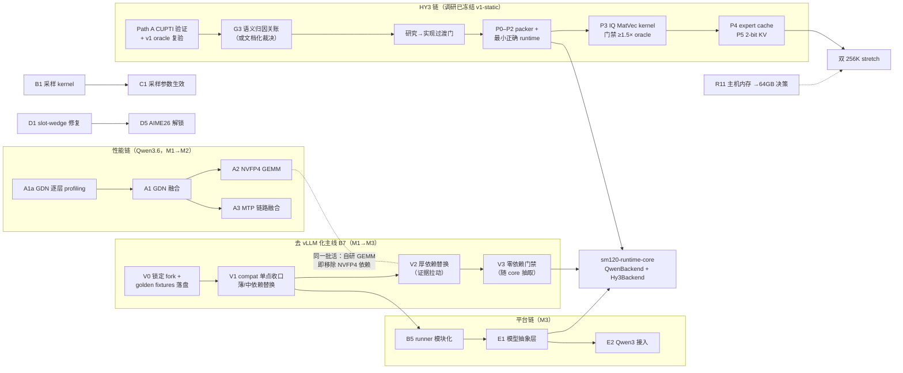

# BlackForge 后续路线图（2026 H2 → 2027 H1）

> 从「Qwen3.6-27B 专用推理机」演进为「SM120 上的小型多模型推理平台」。五条并行轨道：当前模型性能深挖、架构弹性化（含去 vLLM 化主线）、兼容层补全、观测性与质量加固、多模型支持（Qwen3 系列 与 HY3 MoE）。HY3 侧已有独立调研仓库 `hy3-sm120-research` 冻结到 v1-static——其门禁证据与 P0–P7 实现阶梯直接并入本路线。每一项都沿用既有的门禁文化：有证据才动手，过回归才合入。
>
> **里程碑**：
> - **M1（2026-08）补齐与加固**：采样真实生效 · slot-wedge 修复 · 长稳 soak · GDN profiling 取证 · HY3 Path A 验证 + v1 复验 · 去 vLLM 化 V0–V1（独立建仓：pin 官方 vLLM + compat 收口）
> - **M2（2026-09/10）性能深挖**：GDN 融合 · NVFP4 GEMM autotune（兼去 vLLM 化 V2）· MTP 链路融合 · HY3 G3 关账与过渡门裁决
> - **M3（2026-Q4）弹性与平台化**：动态 KV 分配 · 模型抽象层 · Qwen3 系列接入 · HY3 P0–P2 正确性阶梯 · 去 vLLM 化 V2 按证据推进
> - **M4（2027-H1）新模型与扩展**：HY3 P3–P5（IQ kernel · expert cache · 2-bit KV）· sm120-runtime-core 收敛 + 零依赖门禁（V3）· 自动回退
>
> 编制于 2026-07-22；同日修订：并入 HY3 调研现状 + 新增 B7「去 vLLM 化」主线（分步混合 + 证据拉动替换，2026-07-22 沟通确认）。配套架构文档见 [architecture.md](architecture.md)。

## 目录

1. [现状盘点：已锻成与未竟](#1-现状盘点已锻成与未竟)
2. [规划原则与北极星指标](#2-规划原则与北极星指标)
3. [路线总览与依赖关系](#3-路线总览与依赖关系)
4. [Track A · 当前模型性能优化](#4-track-a--当前模型性能优化)
5. [Track B · 架构优化（含 B7 去 vLLM 化）](#5-track-b--架构优化含-b7-去-vllm-化)
6. [Track C · 兼容层补全](#6-track-c--兼容层补全)
7. [Track D · 观测性与质量加固](#7-track-d--观测性与质量加固)
8. [Track E · 多模型支持（Qwen3 系列 与 HY3 MoE）](#8-track-e--多模型支持qwen3-系列-与-hy3-moe)
9. [里程碑验收与档位](#9-里程碑验收与档位)
10. [风险登记与应对](#10-风险登记与应对)
11. [不做清单](#11-不做清单)

---

## 1. 现状盘点：已锻成与未竟

| 已完成（截至 2026-07） | 未竟 / 已知短板 |
|---|---|
| 自研 SM120 decode attention kernel（1.56× vs FlashInfer）· FP8 KV + 256K 上下文 · MTP K=3 投机解码（免快照 GDN spec 机制）· CUDA Graph 全批预捕获 · 内容寻址前缀缓存（P0–P3 三级）· OpenAI/Anthropic 双协议 + SSE · Prometheus 指标 · 质量三层证据链（MMLU-Pro 对标 / HumanEval+ A/B / 回归门禁）· 170+ 单测 + CI | **仅 greedy 解码**（采样参数收下但不生效）· **16K+ 长生成存在 slot-wedge 风险**（AIME26 评测因此推迟）· **生产路径硬依赖本地 vLLM fork**（模型图 / NVFP4 加载 / FLA 算子 / backend 注册胶水——没有 `/home/bot/vllm` 服务起不来，无法独立部署维护）· KV 容量按槽静态划分（上下文/并发启动时锁死）· GDN 48 层与 NVFP4 GEMM 仍用 vLLM 通用 kernel（原规划 Phase 6/7 未启动）· 单模型硬编码假设散布在 6506 行 runner 中 · 无自动回退 · 评测覆盖缺 AIME26 / GPQA |

一句话概括：**热路径的骨架已经锻成且经过质量验证；剩下的收益藏在 GDN/GEMM 两块最大的 kernel 占比里，而平台化的前提是把「Qwen3.6 专用」的隐式假设显式化。**

> **第二份资产：`hy3-sm120-research`（2026-07-16 → 07-19）。** HY3（混元 v3）在 SM120 上的推理可行性调研已远超「spike」阶段：静态研究冻结为 v1-static（1,298 tensor 全量清点、15,168 个 expert bundle 精确清单、显存预算表）；G1 oracle、H2 确定性基线、G2 六负载真实路由 trace 已完成；G3 基线分解部分完成，语义归因被一个已定位根因的 CUPTI 限制阻塞（解法 Path A 待验证）；T1–T5 五项静态研究收口。该仓库刻意不做实现——它产出的是**工程合同与门禁证据**，本路线图的 Track E 据此重写（第 8 节）。

## 2. 规划原则与北极星指标

- **证据先行**：任何 kernel 级投入前必须有 nsys/ncu 占比数据背书（M1 的 GDN profiling 是 M2 全部性能工作的门票）；
- **质量门禁**：每次融合/替换都过完整质量回归（greedy 固定集无漂移、MTP 接受率下降 < 1pp、HumanEval+ parity），收益按 **accepted tokens/s 与 ITL** 结算，不看 draft/s；
- **一次一个变量**：沿用 Stage A/B/C 阶梯方法论，新模型接入同样先建 oracle 再替换；
- **范围解冻有序**：每个里程碑最多解冻一个「范围合同」维度（M1 解冻采样，M3 解冻单模型，M4 解冻量化格式），其余维持冻结。

| 北极星指标 | 当前基线 | 方向 |
|---|---:|---|
| accepted tokens/s（128K × 4 并发，warm） | 222 | 持续上升，按验收档位结算（第 9 节） |
| p50 ITL / TTFT（Agent Replay 负载） | 基线待 M1 冻结 | ITL 优先；TTFT 不明显恶化 |
| MTP 接受率 | ≈ 50% | 不因任何优化下降 > 1pp |
| 质量差值（MMLU-Pro vs 官方） | −1.7pp（噪声内） | 始终保持在抽样噪声内 |
| 长稳（24h soak 无 wedge / 无泄漏） | 未建立 | M1 建立并纳入例行 |

## 3. 路线总览与依赖关系

四条链并行：性能链「profiling → GDN → GEMM」、去 vLLM 化主线「锁定 → 收口 → 厚依赖替换 → 零依赖门禁」、平台链「模块化 → 抽象层 → Qwen3」、HY3 链「Path A → G3 关账 → 过渡门 → P0–P7」，最终在 sm120-runtime-core 收敛。

> **排序修正（相对首版路线图）**：HY3 调研的完成度推翻了「先 Qwen3 踩实抽象层、再启动 HY3」的串行假设。两条链现已**解耦**：HY3 按其研究仓库自带的过渡门与 P0–P7 阶梯在独立实现仓库推进（正确性优先、逐层对 oracle）；Qwen3 仍是抽象层的低风险验证样本，但不再是 HY3 的前置。两线在「sm120-runtime-core 抽取」处收敛——调研文档当时设置的前提「Qwen 执行链全模型正确后才共用基础设施」，如今已被 BlackForge 的三层质量验证满足，收敛时机的讨论可以提前。

## 4. Track A · 当前模型性能优化

原规划 Phase 6–9 的落地版：48 层 GDN 是最大的未开采矿脉，其次是 NVFP4 GEMM 与 MTP 链路。

| 工作项 | 内容与关键动作 | 门禁（合入标准） | 优先级 / 工作量 / 里程碑 |
|---|---|---|---|
| **A1a** GDN 逐层 profiling | nsys 分解每个 GDN 层的完整 kernel 序列；建立单层 replay 基准；产出 decode step 时间占比账本，更新 `notes/` 证据链 | 占比数据可复现；与 Phase-0 gap ledger 交叉验证 | P0 / S / M1 |
| **A1** GDN 全栈融合 | 按占比依次尝试：input projection 融合、gate/activation 融合、conv/state update 融合、norm+residual 融合、persistent workspace、消除临时 tensor；终态目标是把一个 GDN block 压成少数几个 kernel | 单层 ≥10% 提升才进 runtime；1000-step 状态演化正确；四槽 reset/复用正确；每次融合过完整质量回归 | P0 / L / M2 |
| **A2** NVFP4 GEMM 自研与 autotune | 按占比排序替换：GDN/attention in_proj → MLP gate-up → down_proj → o_proj → MTP proj → lm_head；每 shape 建 autotune 表（prefill M / decode M=1..4 / verify M=4..16）；评估 fused QKV / fused gate-up 双布局。**与 B7-V2 合并：自研 GEMM 落地即同步移除对 vLLM NVFP4 linear 的最后依赖** | 只有端到端 ≥1% 的权重副本才保留；计入额外显存与加载时间 | P1 / L / M2→M3 |
| **A3** MTP 链路融合与 DFlash 评估 | 融合 draft logits / verify attention / acceptance / token compact-scatter；随后单独评估 DFlash（绝不与 MTP 重写同时进行） | 按 accepted tok/s 结算净收益；接受率不降 >1pp；关闭投机时 fallback 稳定 | P1 / M / M2 |
| **A4** 剩余显存换速度 | 系统化 A/B：decode/prefill 双权重布局、更大前缀缓存、KV hot-window 连续布局、CUDA Graph 多 bucket、高频小矩阵特殊副本 | 每项独立 A/B（额外显存 / 额外写入 / TTFT / ITL / accepted tok/s 五项全记） | P2 / M / M3 |
| **A5** 长 prefill 优化 | chunked prefill 与他槽 decode 交错调度（与 B4 联动），压 TTFT 尾部；128K+ 冷启动路径专项 | 长 prefill 期间其余槽 ITL 恶化 <10% | P1 / M / M2 |

## 5. Track B · 架构优化（含 B7 去 vLLM 化）

把「启动时锁死」的决策逐个变成运行时弹性，为多模型腾出结构空间——并新增 B7「去 vLLM 化」主线，让项目脱离本地 vLLM fork 独立运行与维护。

| 工作项 | 内容与关键动作 | 门禁（合入标准） | 优先级 / 工作量 / 里程碑 |
|---|---|---|---|
| **B1** 采样支持 | graph-safe 的 temperature / top-p / top-k 采样 kernel（持久 buffer 内完成，不破坏 CUDA Graph 重放）；greedy 保持为 temperature=0 特例 | 固定种子下可复现；greedy 路径 bit 级不变；图/eager parity 检查扩展覆盖采样 | P0 / M / M1 |
| **B2** 动态 KV 分配 | 打破每槽静态 `blocks_per_slot` 配额，让 BlockPool 成为全局预算池：短请求少占、长请求多借，上下文与并发运行时弹性权衡；容量门控随之改为全局预算判定 | 压力下无 OOM；借还路径过前缀缓存全部不变量（INV*）测试；最坏情形回退到静态配额行为 | P1 / L / M3 |
| **B4** prefill / decode 解耦调度 | 引擎主循环支持轮内插入 prefill chunk，长 prefill 不再独占整轮；与 A5 配套 | 调度公平性基准 + 现有 slot 生命周期测试全绿 | P1 / M / M2 |
| **B3** 请求暂停/恢复 | 会话级 pause/resume 保留 cache（session affinity 的推广），multi-agent 长会话切换不付重算成本 | 暂停槽被抢占后仍能经前缀缓存温启动；TTL 驱逐正确 | P2 / M / M3 |
| **B5** runner 模块化重构 | 把 6506 行 `direct_model_runner.py` 按分页/前缀缓存、MTP、CUDA Graph、元数据构建四域拆分——在 E1 抽象层动刀之前完成，纯移动不改逻辑。**B7-V1 的 compat 收口自然产出本项的模块边界，二者同批执行** | 拆分前后全测试套件与基准输出 bit 级一致（parity 门禁） | P1 / M / M3（E1 前置） |
| **B6** 多 GPU 可行性评估 | 仅评估不实施：TP 切分对固定槽位/CUDA Graph/GDN 状态模型的冲击面分析，产出 go/no-go 报告 | 报告含收益上限测算与工程成本估计 | 远期 / S / M4 |

### B7 · 去 vLLM 化主线（P0 · M1→M4）

**问题定性**：生产路径 `runtime/direct_model_runner.py` 对本地 vLLM 树是**运行时硬依赖**——模型图与 NVFP4 加载（`get_model` / `EngineArgs`）、attention/GDN 元数据类型与 backend 注册、`bind_kv_cache` / `set_forward_context`、FLA 算子、MTP 加载（`load_eagle_model`）全部经由本地 vLLM 树。核查发现（2026-07-22）：`/home/bot/vllm` **甚至不是 fork**，而是上游 v0.25.0 检出 + 5 个文件 +135/−52 行**未提交**补丁（多服务于 stock-vLLM 基线路径，非 BlackForge 生产路径）+ 一个散落树内的未跟踪文件 `sm120_gqa.py`（1115 行，本应属于 sm120-flash-attention）。当前最痛的不是「依赖 vLLM」，而是「依赖不可复现的本地状态」。

**已决策路线（2026-07-22 沟通确认）：分步混合 + 证据拉动替换。** 「独立」与「剥离」解耦为两级验收：

1. **独立建仓门禁（V1 末）**——干净 venv 中以 **pinned 官方 vLLM（v0.25.x）** 为可选依赖完成可复现安装与启动，依赖面收口到 `compat_vllm.py` 单点；
2. **零依赖门禁（V3，方向而非截止日）**——厚依赖**按证据逐个退出**：性能证据拉动（profiling 占比 + SM120/模型专用化空间，如 A1a→GDN、A2→NVFP4 GEMM，与 decode attention 自研同一路径）或平台证据拉动（E1 抽象层需要自有模型图、core 抽取），每项替换单独过 golden fixtures parity 与各自收益门禁；**vLLM 中已足够好又不挡路的部分可无限期停留在界面之后**。这正是 OpRegistry「逐个替换」哲学从 kernel 层到整个依赖面的推广。

**终态收敛蓝图**见 [architecture.md 第 3 节「终态架构：完全剥离 vLLM 之后」](architecture.md#3-终态架构完全剥离-vllm-之后)：终态分层图、逐项替换映射表（每个 vLLM 触点 → 终态组件 → 拉动信号）、ForwardContext 显式状态流、权重加载流水线与迁移不变量——每一次 V2 替换都必须落在该蓝图的某个格子里。

依赖分级（不做「重写一个 vLLM」）：

| 级别 | 依赖 | 替换方式 | 工作量 |
|---|---|---|---|
| **薄**（纯胶水） | `SM120GQAMetadata` / `GDNAttentionMetadata`（dataclass）· `bind_kv_cache` · `set_forward_context` · `register_backend` · worker 初始化 · triton_utils | 自写。metadata 本就是手工构建的，dataclass 定义搬进本仓库；backend 注册这层间接直接删——改为**直调 sm120-flash-attention 的 kernel 入口**（kernel 是自己的，只有注册胶水是 vLLM 形状的） | 2–4 天 |
| **中**（有上游可换） | FLA 算子（GDN kernel、chunk indices）· causal-conv1d | 非 vLLM 原创，改为直接依赖上游 pip 包（`flash-linear-attention` / `causal-conv1d`）并锁版本——vLLM 只是转了一手 | 3–5 天（含数值 parity） |
| **厚**（真正的依赖） | 模型图 + NVFP4 量化 linear（`get_model`）· MTP draft 加载（`load_eagle_model`） | 自研模型图 + 接通自有 loader（V2 阶段）；NVFP4 GEMM 与 A2 合并做 | 3–6 周 |

分阶段执行：

| 阶段 | 内容 | 出口门禁 | 里程碑 |
|---|---|---|---|
| **V0** 锁定与取证 | ① 5 个未提交补丁提交为有名字的 patch 并存档 `notes/`，逐个确认与生产路径的关系（初判：多服务于 stock-vLLM 基线，direct runner 绕开了被改的 Scheduler/KVCacheManager）；② `sm120_gqa.py` 迁回 `sm120-flash-attention`（本有 out-of-tree 注册机制）；③ 查清两个未跟踪 `csrc/` marlin 目录的来源；④ vLLM 依赖 pin 到 v0.25.x + lock，CI 加 hermetic 安装；⑤ **用当前正常系统落盘 golden fixtures**（固定 prompt 集逐层 logits、GDN state、MTP 接受序列）——后续所有替换的裁判，动手前必须录好 | 补丁清单入库且与生产路径的关系逐个判明；fixtures 可复现；hermetic CI 绿 | M1（2–3 天，立刻做） |
| **V1** 接口收窄 = 独立建仓 | 全仓库 vLLM import 收口到单文件 `runtime/compat_vllm.py`（依赖面从此可枚举）；薄依赖逐个自写替换、forward context 改显式传参；sm120-flash-attention 增加不经 backend registry 的直调 API；FLA / causal-conv1d 切上游包；BlackForge 以 `pip install blackforge[vllm-provider]`（pinned 官方 vLLM）形态独立建仓——需验证官方 wheel 在 SM120 + CUDA 13 可用，否则 pin 源码 tag 构建 | **独立建仓门禁：干净 venv + pinned vLLM 可复现安装启动，质量回归全绿**；`compat_vllm.py` 只剩 `get_model` / `load_eagle_model` / NVFP4 linear 三个符号；fixtures 全比对通过 | M1→M2（1–2 周） |
| **V2** 厚依赖替换（证据拉动，无固定排期） | 三个厚符号各有各的「拉动信号」，被拉动才替换：**NVFP4 linear ← A2**（性能拉动：occupancy 排序 + autotune，自研 GEMM 落地即退出 vLLM，过渡期可 vendor 该 op 源码保先能跑）；**模型图 ← A1 深度融合或 E1 抽象层**（GDN block 级融合与「模型描述」接口都需要自有 layer graph——届时按原规划补齐 `qwen36_model.py` / `gdn_layer.py` 等，`loader/` 升级为真实加载器）；**`load_eagle_model` ← A3 MTP 融合**。未被任何信号拉动的部分**合法地留在界面后** | 每项替换独立结算：逐层 oracle 比对（`oracle/comparator.py`）+ 各自收益门禁（A1 单层 ≥10% / A2 端到端 ≥1%）+ greedy 固定集无漂移；沿用 Stage A/B/C 一次一个变量纪律 | M2 起随 A1/A2/A3/E1 各自节奏 |
| **V3** 零依赖收口（方向门，随 core 抽取关闭） | 三个厚符号全部退出后：删除 `compat_vllm.py`；`vllm_*_baseline.py` 移入 `extras/`，vLLM 降级为 A/B 对比时才装的 dev 依赖；README 架构说明更新。与 `sm120-runtime-core` 抽取同批执行；若届时仍有未被证据拉动的厚依赖，做一次显式的「保留 or 强制替换」决策并记录 | CI 固定门禁：**干净 venv（无 vLLM）安装 → 启动 → 冒烟 → 质量回归全绿** | M4（与 core 抽取同批） |

B7 与 **B5（runner 模块化）、E1（模型抽象层）、A2（NVFP4 GEMM）合并为同一条主线**排期，不额外新开线：V1 的接口收口自然产出 B5 的模块边界；V2 若被 E1 拉动产出自有模型图，即是「模型描述」接口的第一个实现。附带红利：HY3 链走 GGUF/llama.cpp oracle 本就不经 vLLM，core 无 vLLM 化后，`sm120-runtime-core` 的抽取会干净得多。**节奏要点：V0+V1（约两周）即达成「独立项目」目标**——可复现、可公开、依赖面收敛为一个文件里的三个可枚举符号；此后零依赖只是性能路线顺路收割的方向，不再是悬在头上的排期。

## 6. Track C · 兼容层补全

目标客户是 coding agent：优先补「agent 真的会用到」的语义，而不是追协议全集。

| 工作项 | 内容与关键动作 | 门禁（合入标准） | 优先级 / 工作量 / 里程碑 |
|---|---|---|---|
| **C1** 采样参数真实生效 | temperature / top-p / top-k / seed 从「收下即弃」变为透传 B1 采样 kernel；文档同步撤掉 greedy-only 限制 | API 层参数覆盖测试；默认值与 OpenAI/Anthropic 语义一致 | P0 / S / M1（依赖 B1） |
| **C5** 取消与超时语义完备 | 客户端断连 → 立即释放槽位并终止该槽计算；请求级 timeout；两协议的取消错误码对齐 | 断连后槽位回收 <1 round；无泄漏（soak 验证） | P0 / M / M1 |
| **C3** 结构化输出 | JSON mode / `response_format`（json_schema）：logits mask 引导解码；coding agent 工具参数可靠性直接受益 | schema 遵从率基准；与 MTP verify 兼容（draft 也须受同一 mask） | P1 / L / M3 |
| **C4** 流式工具调用增量 | tool_call 参数以增量 JSON（OpenAI delta / Anthropic input_json_delta）边生成边推送，替代当前的「冻结到结束再发」 | Claude Code / Desktop 实机联调通过；残缺 JSON 前缀不泄漏 | P2 / M / M3 |
| **C2** logprobs | logprobs / top_logprobs 返回（评测工具与 cascade 路由常用） | 与 HF 参考实现数值对齐（容差内） | P2 / S / M3 |
| **C6** Anthropic prompt caching 语义 | 把 `cache_control` 声明映射到内部前缀缓存（命中即回报 cache_read tokens），Claude Code 的成本可视化随即正确 | usage 字段与实际命中深度一致 | P2 / S / M3 |

## 7. Track D · 观测性与质量加固

性能路线越激进，护栏越要先行——M1 把「看不见的故障」全部变成曲线和告警。

| 工作项 | 内容与关键动作 | 门禁（合入标准） | 优先级 / 工作量 / 里程碑 |
|---|---|---|---|
| **D1** slot-wedge 根因修复 + watchdog | 复现并修复 16K+ 长生成的槽位卡死；引擎轮级 watchdog（卡死槽强制回收 + 计数指标）作为纵深防御 | 32K token 连续生成 × 100 次零 wedge；watchdog 触发路径有测试 | P0 / M / M1 |
| **D4** 长稳 soak 例行化 | 24h+ 混合负载（长短请求、断连、超时、前缀命中/未命中交错）压测脚本；显存/句柄泄漏监控；OOM 恢复与崩溃后状态清理演练 | 零泄漏、零 wedge、指标无漂移；纳入每周例行 | P0 / M / M1 |
| **D2** 指标细化 | MTP 每轮接受数直方图、前缀命中深度分布、每槽 KV 占用、GDN checkpoint 池水位、采样参数分布（B1 后） | Grafana 看板随指标同步更新 | P1 / S / M1→M2 |
| **D3** 请求级 tracing | admission → prefill → 各 MTP round 的 span 级追踪（轻量自研或 OTel），慢请求可下钻到轮级 | 开销 <1% 吞吐；采样率可配 | P1 / M / M2 |
| **D5** 评测补全与例行化 | AIME26（依赖 D1 解锁 16K+ 生成）、GPQA Diamond（gated token）、LiveCodeBench 子集；质量回归 + MMLU-Pro 快照进入每周定时任务，波动超噪声即告警 | 三个新基准各有官方可比分数与噪声区间标注 | P1 / M / M2→M3 |
| **D6** 自动回退 | 健康检查连续失败 → 流量自动切到 stock vLLM fallback 并告警；恢复后人工确认切回 | 注入故障演练：切换 <30s，请求无丢失（重试语义明确） | P2 / M / M4 |

## 8. Track E · 多模型支持（Qwen3 系列 与 HY3 MoE）

HY3 的「架构调研 spike」实际早已完成并远超预期深度——本节按 `hy3-sm120-research` 的冻结合同与门禁证据编写。

### E1 · 模型抽象层（P0 / L / M3）

当前 runner 中的 Qwen3.6 假设（16+48 层型、GQA 24:4、head_dim 256、自带 MTP、NVFP4）参数化为三个接口：**模型描述**（层型序列、缓存物种与几何，推广 `CacheGeometry`）、**量化插件**（loader 侧格式校验 + runtime 侧 GEMM 派发，推广 `OpRegistry`）、**格式适配**（chat template、thinking 标记、工具调用语法按模型注册）。HY3 调研为抽象层给出了**真实的第二租户需求清单**：expert cache 作为新的缓存物种、GGUF/IQ 系量化插件、量化 paged KV、union-batch 的 MoE 派发——抽象层设计必须让这些能挂进来而不是再改一轮。门禁不变：抽象层落地后 Qwen3.6 路径全部测试与基准 **bit 级不变**（B5 模块化重构是前置）。

### E2 · Qwen3 系列接入（P1 / M / M3）

选一个结构最近的 Qwen3 型号做抽象层的低风险验证样本：权重易得、可直接用 stock vLLM 建 oracle、chat template 同族。验收即抽象层的验收——新增模型不改 runner 核心，只增描述与插件。**排序修正：E2 不再是 HY3 的前置**（HY3 走独立实现仓库），但仍先于 sm120-runtime-core 抽取完成，为收敛提供第二个已验证租户。

### E3 · HY3（混元 v3）MoE 接入（P1 / L / M1→M4 分阶段）

> **调研现状（`hy3-sm120-research`，冻结 v1-static，2026-07-19）**：静态清点、显存预算、offload 设计、kernel 路线、验证计划、风险登记十余份合同文档齐备；G1 oracle 与 H2 确定性基线通过；G2 六负载真实路由 trace + 16 格 cache 矩阵完成；G3 基线分解部分完成；T1–T5 静态研究收口。该仓库刻意不做实现，下述阶段全部以其「研究→实现过渡门」为准入。

#### 事实基线

| 维度 | 调研确认的事实 |
|---|---|
| 模型 | 腾讯混元 v3（Hy3 192×10B MoE）：80 层 trunk + 1 个 MTP 层（blk.80，2.151 GiB）；GQA 64 Q / 8 KV head，head_dim 128；**192 routed experts top-8 + 1 shared expert**；sigmoid 路由 + correction bias + scaling 2.826（顺序不可交换）；上下文 256K |
| 量化真相 | 「1-bit / IQ1_M」只是文件名标签——artifact 实为**九种类型混合**：routed gate/up 为 IQ1_M（1.75 bpw，40 层）/ IQ2_XXS（39 层），down 全 IQ3_XXS；attention Q8_0；shared expert Q5_K/Q6_K；另有 F32/Q2_K/Q4_K。首批 kernel 必须覆盖全部类型（风险 R1）；ik_llama 的 IQ1_M_R4 重排格式**无法无损转换**（T2），首版基于标准格式 |
| 显存账本 | artifact 85.454 GiB；无 MTP 主干 83.303 GiB vs 可用 95.593 GiB → 仅 **12.29 GiB 余量**；routed experts 76.33 GiB 占 91.6% → **expert offload 是核心命题**，而非 1-bit kernel 本身 |
| 冻结目标 B | **双 slot 64K + 单 slot 256K，均无 MTP**（2-bit 级 KV 规划）；双 256K 为 stretch，被 PCIe 流量证据与主机内存（R11：需 64 GB 物理 RAM）双重门控 |
| offload 证据 | 15,168 个 expert bundle（均 ≈5.15 MiB，expert-plane 字节连续可 DMA）；G2 真实 trace 回放：5 GiB cold 层 + frequency+recency 策略均值 **15.96 MB/token**（远低于 500 MB/token 流量门），但**单步峰值 667.85 MB/token 否决任何 latency-safe 主张**；实测 pinned H2D 57.6 GB/s |
| kernel 优先级张力 | G3 诊断路径显示 **decode 阶段 attention ≈48–49%、routed experts 仅 ≈22%**（prefill 则 experts ≈71%）——与「MoE 带宽主导」先验冲突；但诊断路径需禁用 CUDA Graph replay，**不构成 normal-path 有效裁决**，首个自定义 kernel 的选择必须等 G3 关账 |

#### 分阶段计划（对齐研究仓库 P0–P7 阶梯）

| 阶段 | 内容 | 门禁（合入/晋级标准） | 里程碑 |
|---|---|---|---|
| **E3-0** 解阻塞 | ① **Path A CUPTI 验证**：`cudaGraphGetNodes` + `cudaGraphNodeGetToolsId` 建立 capture-time 节点 → tensor 映射，打通 normal-path 语义归因（唯一关键阻塞的推荐解法，需独立 GPU 实验）；② **v1 复验**：名字对齐 oracle 补丁（已写、未编译）在 v1 artifact 上复现 v0 H2 digest——一次实验同时验证补丁生效、router bias 加载、载荷比特一致 | Path A 拿到 (graphId, nodeId) join 或触发兜底决策；H2 digest 复现则 G1/H2/G2 证据平移到 v1 | M1 |
| **E3-1** G3 关账 + 过渡门 | normal-path 语义 Amdahl 出账，裁决 attention vs routed experts 的真实占比，确定首个自定义 kernel；Path A 失败则由研究负责人做「显式不确定性下采用诊断证据」的文档化裁决（Path B/C 仅补充）；同步落定实现仓库位置与 R11 主机内存（→64 GB）决策 | 研究→实现过渡门四条件全满足（语义证据或文档裁决 · oracle 合同保持 · 实现门单独批准 · 双 256K 另行门控） | M2 |
| **E3-2** P0–P2 正确性阶梯 | 离线无损 packer（重排原量化 block，排除 blk.80，产物 manifest 驱动）→ `Hy3WeightStore` → 最小正确 runtime（attention → 精确 router → routed/shared experts → one-token decode），直接复用 AngelSlim 转换与 oracle 接口（T1 结论）；GGUF 绝不进 decode 热路径 | 13 步验证计划逐级通过：单 IQ block 解码 → 单 expert → router top-8 exact ids → 单层 → 全模型 → 双 slot 顺序/隔离 | M3 |
| **E3-3** P3 IQ kernel | SM120 routed-expert kernel：IQ block 直接解码进寄存器立即消费（**禁止 materialize 反量化矩阵**）→ batch-1 融合 MatVec → 双 slot expert-union 派发；每个候选 kernel 过 Amdahl 准入（预估占比 <5% 不做） | **单 slot decode ≥1.5× oracle 基线（目标 2×）**；正确性先于一切 benchmark | M4 |
| **E3-4** P4–P5 cache 与长上下文 | expert cache（frequency+recency + 完整 bundle 粒度 + PCIe 异步预取，仅允许可记账预取）；量化 paged KV（首选 KIVI 式 2-bit：K per-channel / V per-token，需在 80 层 GQA 256K 上单独验证质量）；逐级放开 双64K → 单256K | 平均 transfer wait <20% decode step、p95 <35%；KV 质量测试通过后才替换 Q8 | M4 |
| **E3-5** P6–P7 可选深化 | profile 驱动的 attention/PTX 优化（准入：单项 ≥10% step time 或能关一个容量门——若 G3 关账证实 decode attention ≈48%，此项优先级上调）；MTP 重启实验（重加 2.151 GiB blk.80） | MTP 仅在净 tok/s ≥20% 且不破坏长上下文时进正式路径；双 256K 需实测 H2D + 64 GB 主机内存双证据 | M4 之后 |

#### 与 BlackForge 的收敛

调研文档已明确终态：**同一 runtime 下的 `QwenBackend` 与 `Hy3Backend`，抽出共同的 `sm120-runtime-core`**——复用与模型无关的固定槽位调度、CUDA Graph bucket、sampler、streaming server 与请求生命周期；模型 kernel 与权重格式各自独立。调研当时设置的前提「Qwen 执行链全模型正确后才共用」已被 BlackForge 的三层质量验证满足，因此 core 抽取的接口设计可以与 E1 抽象层**合并为同一件事**来做（E1 的三接口 + core 的组件边界互为表里）。过渡期纪律保持：HY3 实验绝不修改 Qwen 生产路径，GPU 资源按窗口互相让路，两租户 kernel 与缓存配置完全隔离。

## 9. 里程碑验收与档位

性能档位沿用立项文档的四档制；每个里程碑出口都有明确的「过/不过」判据。

| 里程碑 | 出口判据（全部满足才关闭） |
|---|---|
| **M1** 补齐与加固（2026-08） | 采样端到端生效且 greedy bit 级不变 · slot-wedge 零复现（32K×100 次）· 24h soak 零泄漏 · GDN 占比账本发布 · Agent Replay ITL/TTFT 基线冻结 · **HY3：Path A 实验有结论 + v1 复验（H2 digest 复现）** · **去 vLLM 化：V0 完成（fork 补丁清单入库 + golden fixtures 落盘）+ V1 启动** |
| **M2** 性能深挖（2026-09/10） | 达成 **v1 档：Agent Replay c4 的 p50 ITL 提升 ≥10%**，质量不回退 · MTP 接受率不降 >1pp · 图/eager parity 全绿 · AIME26 评测入库 · **HY3：G3 语义账本关账（或文档化裁决）+ 研究→实现过渡门裁决 + 主机内存/实现仓库两项决策落定** · **去 vLLM 化：V1 收官 = 独立建仓门禁达成（干净 venv + pinned 官方 vLLM 可复现安装启动，compat_vllm.py 只剩三个符号）；V2 随 A2 节奏启动** |
| **M3** 弹性与平台化（2026-Q4） | 达成 **v2 档：W2/Agent Replay 提升 ≥20%，TTFT 不明显恶化** · 动态 KV 压力下零 OOM · Qwen3 第二租户全质量链通过 · 抽象层下 Qwen3.6 bit 级不变 · **HY3：packer + 最小 runtime 过 13 步验证的全模型关卡（P0–P2）** · **去 vLLM 化：被 A2/E1 拉动的替换项完成 parity 合入（NVFP4 linear 预期最先退出；未被拉动的部分合法留在界面后）** |
| **M4** 新模型与扩展（2027-H1） | **HY3：P3 kernel 达 ≥1.5× oracle · expert cache transfer wait 均值 <20% / p95 <35% · 双 64K + 单 256K 目标形态跑通 · Go/No-Go A/B/C 正式裁决记录** · sm120-runtime-core 抽取完成（双租户共架）· **去 vLLM 化 V3 零依赖门禁与 core 抽取同批关闭：干净 venv 无 vLLM 安装 → 启动 → 冒烟 → 回归全绿（仍有未被证据拉动的厚依赖则记录显式保留决策）** · 自动回退演练通过 · 冲刺 **stretch 档：场景收益 25–35%** |

## 10. 风险登记与应对

每条风险都预设降级路径，保证主线永远可发布。

| 风险 | 影响 | 应对 |
|---|---|---|
| GDN 融合收益不及预期（占比或可融合度低于假设） | M2 的 v1 档位落空 | A1a profiling 是硬门票：占比数据不支持则把 M2 重心转向 A2 GEMM 与 A5 prefill；档位目标按证据下修而非硬冲 |
| 采样与 MTP/CUDA Graph 交互引入正确性回归 | 输出质量事故 | greedy 路径 bit 级不变作为硬门禁；采样路径先 eager 后图化；回归套件扩展采样用例 |
| HY3：Path A 验证失败（驱动在 instantiate 时重排节点 ID 等），G3 语义归因持续无 normal-path 证据 | 首个自定义 kernel 选择缺乏有效 Amdahl 依据 | 预设兜底：研究负责人做「显式不确定性下采用诊断证据」的文档化裁决（诊断显示 decode attention ≈48%），Path B/C 仅作补充；该裁决权与风险已写入研究仓库过渡门条件 |
| HY3：主机内存硬门 R11——32 GB 物理 / WSL 仅 ≈23 GiB，撑不住 15–20 GiB cold tier + pinned staging | 双 256K stretch 不可行；expert offload 余量紧张 | 64 GB 内存升级决策前置到 M2；升级前 cold tier 按 5–8 GiB 配置（G2 证据显示该档均值流量最优）；磁盘换页明确不算 cache 策略 |
| HY3：v1 复验未过（oracle 名字 fallback 补丁未编译未测试；payload 比特恒等只能间接证明） | G1/H2/G2/G3 全部证据失效，回到起点 | M1 首个 GPU 实验即「名字对齐 oracle 复现 v0 H2 digest」，一次验证补丁、bias 加载、载荷一致三件事；失败则按 A2 计划逐项排查 |
| HY3：expert 流量单步峰值 667.85 MB/token（G2 实测）造成延迟毛刺 | 长尾 ITL 不可控，latency-safe 不可主张 | P4 门禁按 p95 transfer wait（<35%）而非均值结算；预取仅允许可记账到未来层的 expert；毛刺仍超标则收缩 cold tier 或降并发目标 |
| HY3 实验与 BlackForge 生产共用一张 96 GB 卡 | 互相抢显存 / 干扰基准 | 沿用研究仓库既有纪律：GPU 窗口审批制、HY3 绝不修改 Qwen 生产路径、基准运行独占窗口 |
| 6506 行单文件 runner 在多人/多模型演进下失控 | 迭代速度持续劣化 | B5 模块化重构以 parity 门禁先行；抽象层（E1）只在拆分后的模块边界上动刀 |
| 去 vLLM 化：跳过 V0 直接替换——fork 本地补丁未盘点即丢失、golden fixtures 缺失 | V2 阶段每个数值偏差都变成两周盲调；隐性行为（oracle hook、SM120 修复）无声消失 | V0 是硬前置：diff fork vs 上游存档 `notes/`；fixtures 未落盘不得开始任何替换——这是 direct-model-runner 时期用血换来的教训 |
| 去 vLLM 化：FLA / causal-conv1d 上游包与 vLLM 内嵌版本行为差异（chunk size、kernel 签名、数值细节） | GDN 状态无声漂移，输出质量事故 | 切换时单独过 1000-step GDN 状态演化 + 四槽 reset/复用测试；上游包版本进 lock 文件；fixtures 比对含 GDN state 而不只是 logits |
| 动态 KV 分配破坏前缀缓存不变量 | 隐性输出错误（最危险形态） | INV*/R* 不变量测试全量随行；bootstrap check 在该阶段临时提高采样率；可一键回退静态配额 |

## 11. 不做清单

专用化收益来自持续说「不」。以下维度在本路线图周期内保持冻结：

- **beam search / n>1** —— 与固定槽位模型冲突，agent 场景无需求
- **LoRA / 在线微调** —— 推理专用机，不做训练侧任何能力
- **复杂多租户** —— 配额、计费、隔离等平台能力不进引擎
- **非 SM120 架构** —— 不做 Hopper/Ada 兼容，专用化是立身之本
- **通用 GGUF 支持** —— 只服务 HY3 这一个 artifact 的无损重排 pack，不做通用 GGUF runtime
- **协议全集对齐** —— 只补 agent 实际用到的语义，不追 API 大而全
- **通用框架对标** —— 不与 vLLM 比功能广度，只在目标负载上比快

---

*基于两个仓库整理：`qwen-sm120-runtime`（《项目实施规划》Phase 6–11 未竟项、README 路线图、已知短板）与 `hy3-sm120-research`（v1-static 冻结合同、G1/H2/G2/G3 门禁记录、T1–T5 静态研究、14-forward-plan）。*
